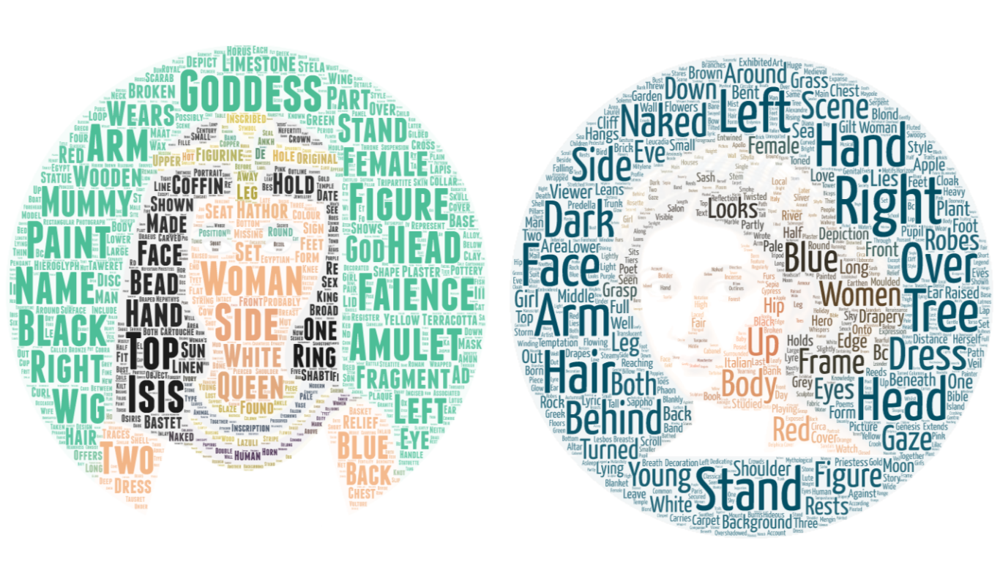

# Learning to visualise data

Last week I had the opportunity to take a one-week course by [Andy Kirk](https://www.visualisingdata.com/about/) about data visualisation, hosted by [Methods at Manchester](https://www.methods.manchester.ac.uk/) as part of the [Summer School](https://www.methods.manchester.ac.uk/connect/events/summer-school-2019/) programme. It was a fantastic experience to be a student again, and I learned a lot about practicat considerations that go into producing effective visualisations that are trustworthy, accessible, and elegant. 

I will not (and cannot) summarise the course here, I recomment anyone interested in creating data visuailisations to get in touch with Andy for courses. But I did want to quickly summarise some really awesome tools, and show off some creations from the course. 


# Resources 

Andy provided loads of great resources for people to use and refer back to when creating visualisation projects. 

On his site [visualisingdata.com](https://www.visualisingdata.com/) there is a [resources tab](https://www.visualisingdata.com/resources/) which lists a pretty much never-ending list of tools. Some which stood out to me where: 

- [D3.js](https://d3js.org/) - I feel like this is the ultimate visualisation tool and I've dabbled with it here and there but I cannot find the time to buckle down and get to grips with Javascript. Not that I haven't tried, I do remember trying to start a book club going through [Eloquent Javascript](https://eloquentjavascript.net/) but it does require an inital time investment, and when the good people of open source are wrapping all these javascript libraries into R packages, then my main incentives are removed. But it is definitely on the todo list. 

- [R](https://www.r-project.org/) - R is so good for data visualisation, and so much easier to learn than Javascript (to me anyway) and also deals so well with all the data manipulation side of things, so it's a 10/10 from me.

- [Flourish](https://flourish.studio/pricing/) - this tool has lots of pre-programmed charting options, and is free to use for public data. I think if you need to keep the data private it begins to cost though...

- [RAWgraph](https://app.rawgraphs.io/) - seemed to be this GUI for creating D3 visualisations. So if you're interested in creating non-standard chart types, this look like a super easy way to do so, and is free. 

- [Gephi](https://gephi.org/) - useful for network visualisation & easy to use and also totally free.

In addition to these, during one of the group exercises our group discovered [word art](https://wordart.com/) - no, not the late 90s MS Word 3D rainbow coloured clipart thing, but a tool to make a wordcloud take the shape of any image you want. I know, I know, [word clouds are "the mulletts of the internet"](https://www.niemanlab.org/2011/10/word-clouds-considered-harmful/), but we did use this to produce some neat visualisations of text, so hey, mulletts can be useful too. For our challenge visualising data about art collections, we looked at words used to describe representations of women in modern art and egyptian art: 



Another useful tool was the [Chartmaker Directory](https://chartmaker.visualisingdata.com/) a crowdsourced collection of all the different charts you could think to use for your data, and a set of all the tools that you can make them in. And if there is something missing which you think should be there, you can submit for it to be added. Very useful tool to help you create your descired visualisation no matter what tool you use. 

# Exercises

The really neat part about being a student again was to explore cool and totally not-related-to-my-work data sets for visualisation. The first one of these was the scripts for the original Star Wars trilogies. The task was to think about what we want to visualise from the data and how. The dataset was split over 3 sheets in Excel (one for each film) and only had 3 variables, sequence (the lines numbered 1-n from first and last line spoken in each film), name of the character speaking, and the line which they said. Inspired by the [New York Times visualisation about Peyton Manning's Touchdowns](https://www.nytimes.com/interactive/2014/10/19/upshot/peyton-manning-breaks-touchdown-passing-record.html) I decided to see who speaks the most in the films. I used R, so I'll include the code for the graph here too. I don't know if the data is up for sharing, but you can easily find transcribed films online, so could reproduce with such data: 

```{r, warning=FALSE, message=FALSE, fig.height=6.5, fig.width=9}


library(readxl)
library(ggplot2)
library(tidyr)
library(dplyr)
library(stringr)

#read in each sheet, create a variable to tag film, and merge into one dataframe
newhope <- read_excel("data/2.OriginalStarWarsScripts.xlsx", sheet = "SW_EpisodeIV")
newhope$film <- "SW_Episode_IV"
newhope$X__3 <- NULL
empire <- read_excel("data/2.OriginalStarWarsScripts.xlsx", sheet = "SW_EpisodeV")
empire$film <- "SW_Episode_V"
jedi <- read_excel("data/2.OriginalStarWarsScripts.xlsx", sheet = "SW_EpisodeVI")
jedi$film <- "SW_Episode_VI"
all_sw <- rbind(newhope, empire)
all_sw <- rbind(all_sw, jedi)

#create new requence to paste together all 3 films
all_sw$pos <- 1:nrow(all_sw)

#create new variable that counts the number of words in each line
all_sw$nwords <- sapply(strsplit(all_sw$Dialogue, " "), length)

#get cumulative words spoken at each line for all characters
talk_vol <- all_sw %>% select(Character, nwords, pos, `Line Number`)
test <- talk_vol %>% 
  spread(Character, nwords) %>% 
  replace(is.na(.), 0) %>% 
  gather("who", "num_chars", -pos, -`Line Number`)
test$csum <- ave(test$num_chars, test$who, FUN=cumsum)

#get the top 10 speakers to highlight them in the chart
top10 <- test %>% group_by(who) %>% 
  summarise(talks = max(csum)) %>% 
  arrange(desc(talks)) %>% head(n = 10) %>% 
  pull(who)

#make points 
pts_test <-  test %>% 
  filter(who %in% top10) %>% group_by(who) %>% summarise(max_char = max(csum),
                                                         max_pos = max(pos))
#plot
ggplot() + 
  geom_vline(xintercept = 1, colour="#A9A9A9", linetype="dashed") + 
  geom_vline(xintercept = 1011, colour="#A9A9A9", linetype="dashed") + 
  geom_vline(xintercept = 1850, colour="#A9A9A9", linetype="dashed") + 
  geom_text(aes(x=1, label="New Hope", y=4600), colour="#A9A9A9", hjust = -0.1) +
  geom_text(aes(x=1011, label="Empire Strikes Back", y=4600), colour="#A9A9A9", hjust = -0.1) +
  geom_text(aes(x=1850, label="Return of the Jedi", y=4600), colour="#A9A9A9", hjust = -0.1) +
  geom_line(data = test, aes(x = test$pos, y = test$csum, group = test$who), alpha = .4) +
  geom_line(data = test %>%  filter(who %in% top10), aes(x = pos, 
                y = csum, 
                colour = who)) +
  geom_point(data = test %>% 
               filter(who %in% top10) %>% group_by(who) %>% summarise(max_char = max(csum),
                                                                      max_pos = max(pos)), aes(x = max_pos, 
                         y = max_char, 
                         colour = who)) + 
  geom_text(data = test %>% 
              filter(who %in% top10 &
                       who != "BEN" ) %>% group_by(who) %>% summarise(max_char = max(csum),
                                                                     max_pos = max(pos)),
            aes(x = max_pos, y = max_char, label=str_to_title(who), colour = who),hjust= -0.1, vjust=0.5, size = 4.5) + 
  geom_text(data = test %>% 
              filter(who == "BEN") %>% group_by(who) %>% summarise(max_char = max(csum),
                                                                     max_pos = max(pos)),
            aes(x = max_pos, y = max_char, label=str_to_title(who), colour = who),hjust= -0.1, vjust= 0, size = 4.5) + 
  theme_minimal() + 
  theme(legend.position="none", text = element_text(size = 16), 
        axis.text.x=element_blank(),
        axis.ticks.x=element_blank(), 
        plot.margin = unit(c(1,0.5,0,0.5), "lines")) +
  labs(title="Cumulative number of words spoken \n by characters in original Star Wars trilogy",
        x ="", y = "")  + 
  xlim(c(0,3000)) +
  ylim(c(0,4700)) + 
  scale_colour_brewer(palette = "Paired")


```


We also got to work with data from the Manchester Museum, Withworth Gallery, and Manchester Art Gallery. Together with another classmate, we used these data (which I am more sure I probably shouldn't share, but I am sure that interested people could get in touch with the Manchester Museum Group to ask) to visualise gender representation in the Manchester Museum's Egypt collection, and the Manchester Art Gallery. Our final product looked like this: 


My colleague Vibhuti made the sanky diagram using Flourish mentioned above, and represents the types of artifacts that gods vs goddessess were represented with. I made the floor plan of the Manchester Art Gallery, with each room shaded by the proportion of paintings painted by male v female artists using the [waffle package](https://cran.r-project.org/web/packages/waffle/waffle.pdf) and the [gridExtra package](https://cran.r-project.org/web/packages/gridExtra/gridExtra.pdf) in R. We assembled everything in MS Publisher. Overall it was good fun and we got to present the results to members of the Manchester Museums Group, so very useful.  

# A note on accessibility

There was a lot of talk about accessibility of charts and this was I think a really important thing to always keep in mind. We discussed accessibility as in is the chart usable, is it suitably understandable, and therefore *accessible to the audience* but also in terms of considering colourbling users for example. Some resources for this: 

- [colororacle.org](http://colororacle.org/) gives a way to check if your colour scheme is colourblind
- [colorbrewer](http://colorbrewer2.org) has colourbling friendly pallette suggestions
- and in our final project we used [coolors.co](https://coolors.co/) which generates a colour palette for you, and allows you to check if its colourblind friendly with different types of colourblindess simulated. 

One thing we didn't talk about (and I appreciate may be out of scope for the course for now) is accessibility of visualisations for those people with visual impairments who would use for example a screen reader to interpret our charts. It would be interesting to learn more about this, and if anyone knows some best practice on making charts even more accessible, I would welcome any tips and links to resources. 
