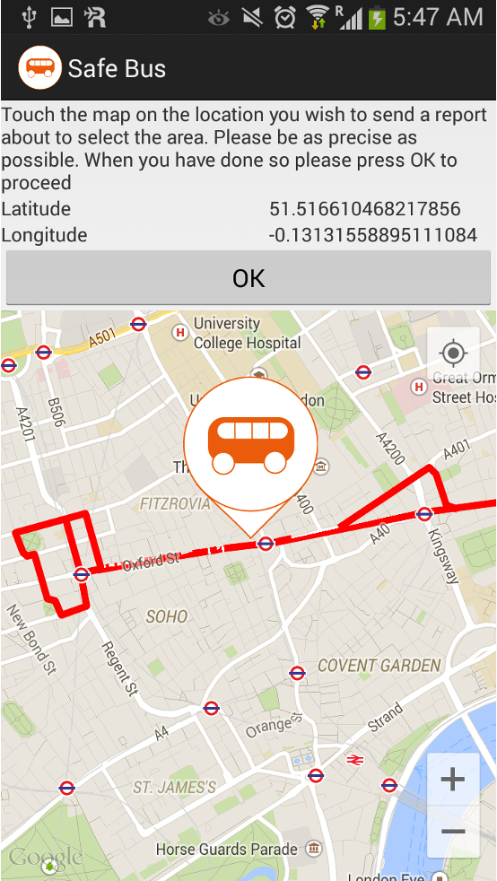
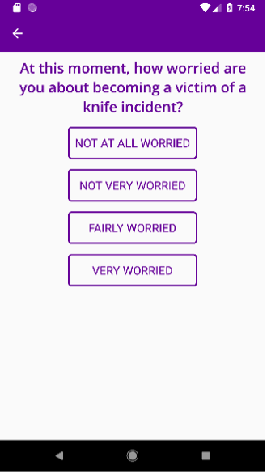
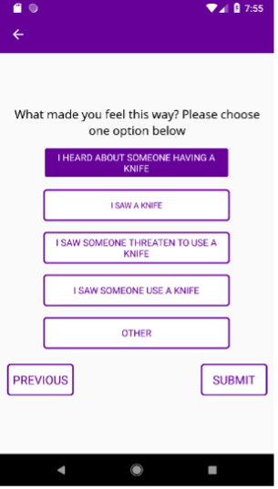
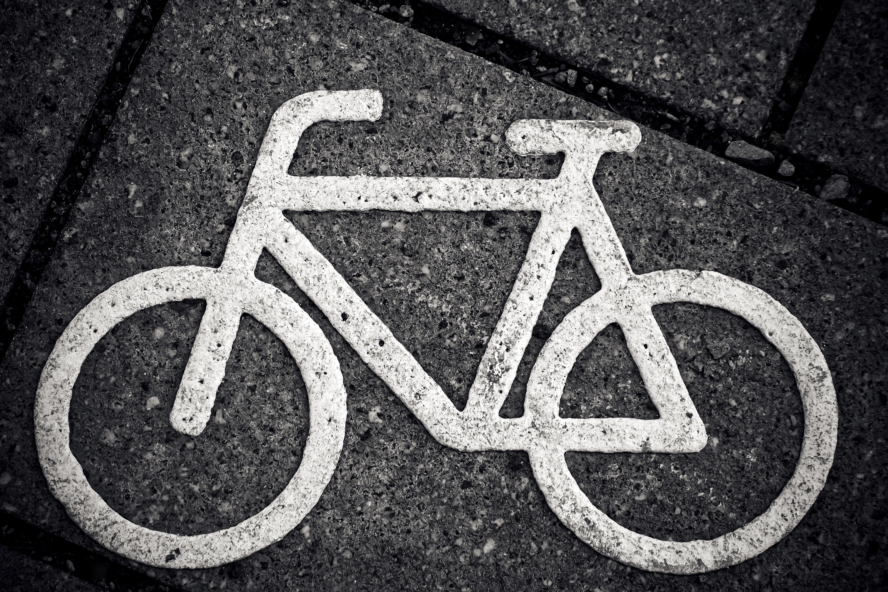
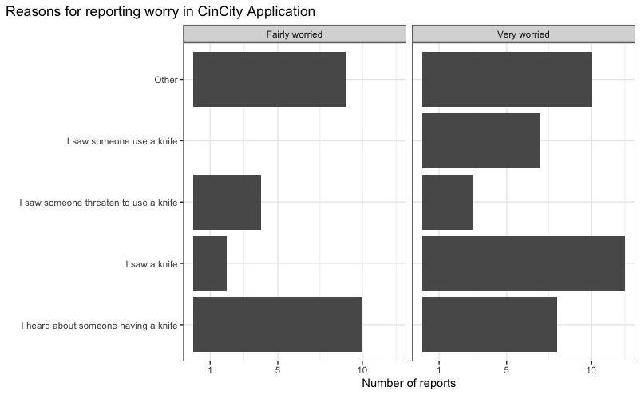
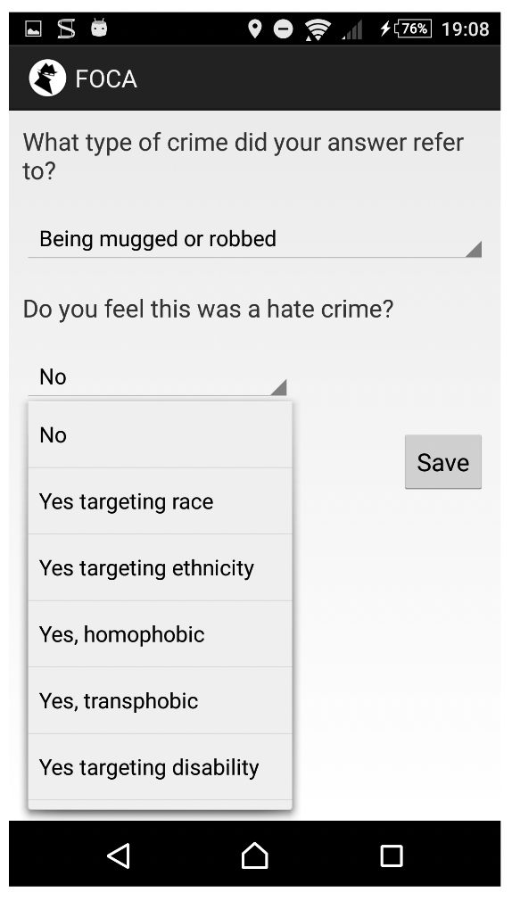

class: center, middle


```{r setup, include=FALSE}
options(htmltools.dir.version = FALSE)
```

# My research

- Fear of crime (place-based approach)
- New (?) or alternative (?) forms of data
- Under-reported crimes


---
class: middle, center, inverse

# App for reporting *fear* of crime

---
background-image: url("img/foca_phone.gif")
background-size: contain

---

background-image: url("img/foca.gif")
background-size: contain

---

background-image: url("img/foca_flow.png")
background-size: contain

---

background-image: url("img/foca_map.png")
background-size: contain

---
.pull-left[

]

.pull-right[



]

---
background-image: url("img/safebus_map.png")
background-size: contain

---
.pull-left[

]

.pull-right[



]

---
background-image: url("img/knife_foc_crime.png")
background-size: contain

---
class: center, middle

# Overall: learned a lot about fear of crime as a context specific, place based experience.

---
class: inverse, center, middle

# Near Misses

--

- What is a near miss? 

--

- Why is this interesting? 

---
class: center, middle


.pull-left[

### The safety pyramid has a long history dating back to 1931 and H.W. Heinrich with his pioneering book *Industrial Accident Prevention: A Scientific Approach*

]

.pull-right[
```{r vertical, echo=FALSE,out.width="80%"}
library(ggplot2)
ggplot() +
  geom_segment(aes(x = 0, xend = 1.5, y = 0, yend = 3), lwd = 3, colour = "#660099") + 
  geom_segment(aes(x = 1.5, xend = 3, y = 3, yend = 0), lwd = 3, colour = "#660099") +
  geom_segment(aes(x = 0, xend = 3, y = 0, yend = 0), lwd = 3, colour = "#660099") + 
  geom_segment(aes(x = 0.5, xend = 2.5, y = 1, yend = 1), lwd = 3, colour = "#660099") + 
    geom_segment(aes(x = 1, xend = 2, y = 2, yend = 2), lwd = 3, colour = "#660099") + 
  geom_label(aes(x = 1.5, y = 2.5, label = "1 major injury"), size = 10) + 
   geom_label(aes(x = 1.5, y = 1.5, label = "29 minor injury"), size = 10) +
   geom_label(aes(x = 1.5, y = 0.5, label = "300 near misses"), size = 10) +
  theme_void() 
``` 

]

---
class: center, middle

- Variations and discussions about the ratios
- All of these studies used large groups and expressed the results in triangles or pyramids


```{r, echo=FALSE}

pyramid_dfs <- tibble::tibble(Level = c("Fatal injury", "Major injury", "Minor injury", 
                                    "First aid only", "Property damage", "Noninjury"), 
                          `Heinrich 1931` = c(" ", 1, 29, " ", " ", 300), 
                          `Bird & Germain 1969` = c(" ", 1, 10, " ", 30, 600), 
                          `Fletcher 1972` = c(" ", 1, 19, " ", " ", 175), 
                          `Tye 1975` = c(1, " ", 3, 50, 80, 400))

knitr::kable(pyramid_dfs) 
```


---
class: center, middle

## General idea: paying attention to and understanding the near misses can possibly lead to understanding and preventing serious incidents.

---
class: center, middle, inverse

# Why is this important? 


---
class: center, middle, inverse

# Reason 1: 

## Even if near misses do not "predict" more serious incidents, they have consequences in themselves

---
# Near misses and fear in cycling


---
background-image: url("img/collideoscope.png")
background-size: contain

---
background-image: url("img/cycling_near_miss.png")
background-size: contain

---

background-image: url("img/fear_cycling.png")
background-size: contain

---
class: center, middle

# Fear of crime also linked with 'near miss'

---
class: center, middle

## Example: FOCApp

> I was on my way into university in the morning, and I was coming into
Euston station and there was someone who looked like they were trying to
remove a bike from the railings that had been locked in, and they didn’t look
like the owners of the bike. And then I suspected they were trying to steal the
bike, so I reported my fear of crime because it was a specific incident of me
seeing what I thought was criminal activity.

---
class: center, middle

## Example: CinCity



---
class: center, middle


## Fear of crime affects:

- equal access to public space

--

- sustainable travel

--

- individual and community wellbeing

---
class: center, middle, inverse

# Reason 2: 

## If near misses predict serious incidents, we can study spatial and temporal patterns of incidents on which we otherwise have sparse data

---
background-image: url("img/knife_foc_crime.png")
background-size: contain

---
background-image: url("img/incident_types_map.png")
background-size: contain

---
background-image: url("img/inc_by_vol.png")
background-size: contain


---
class: center, middle, inverse

# Reason 3: 

## By becoming interested in the near misses, we "lower the barrier" to reporting something, providing insight into crimes which are traditionally underreported

---
background-image: url("img/Blackcap.JPG")
background-size: contain

---
background-image: url("img/black_cap_map.png")
background-size: contain


---

background-image: url("img/bc_closes.png")
background-size: contain


---
background-image: url("img/lgbt_foc.png")
background-size: contain

---
class: center, middle

.pull-left[
## 4 reports labelled as "Hate Crime" (2 x Fairly and 2 x Very worried)
]

.pull-right[



]

---
class: center, middle, inverse

# Conclusions: 

--

- Place/ context specific fear of crime events can be thought of as "near misses"
--

- In any case, may be important in themselves as fear of crime events with real consequences
--

- But if near miss may help identify areas of concern/ interest
--

- And may help complement data sources on underreported incidents

---
class: center, middle

# Relevant Papers

- [Mapping fear of crime as a context-dependent everyday experience that varies in space and time](https://bpspsychub.onlinelibrary.wiley.com/doi/abs/10.1111/lcrp.12076)
- [Towards a Place-based Measure of Fear of Crime: A Systematic Review of App-based and Crowdsourcing Approaches ](https://journals.sagepub.com/doi/abs/10.1177/0013916520947114)
- [Understanding Knife Crime and Trust in Police with Young People in East London ](https://journals.sagepub.com/doi/10.1177/00111287211029873)
- [Thesis](https://discovery.ucl.ac.uk/id/eprint/1541235/1/PhDThesis_PostCorrectionsFinal.pdf)