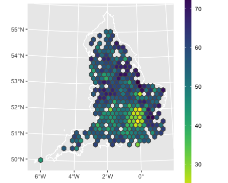

background-image: url(img/covid19map.png)

```{r setup, include=FALSE}
options(htmltools.dir.version = FALSE)
library(xaringanthemer)
style_mono_accent(
  base_color = "#1c5253",
  header_font_google = google_font("Josefin Sans"),
  text_font_google   = google_font("Montserrat", "300", "300i"),
  code_font_google   = google_font("Fira Mono")
)
```


background-image: url(img/covid19mapcontext.png)

???

Image credit: [Andisheh Nouraee](https://twitter.com/andishehnouraee/status/1284237474831761408)

---
class: center, middle

# Maps: visual representation of spatial data

---

# About us

.pull-left[

Réka Solymosi

- [@r_solymosi](https://twitter.com/r_solymosi)

- [rekadata.net](https://rekadata.net/)


]

--
.pull-right[

Sam Langton

- [@sh_langton](https://twitter.com/sh_langton)

- [samlangton.info](https://www.samlangton.info/)


]


---
class: inverse, center, middle

# Why maps?

---
class: center, middle
# Much of human activity happens 'somewhere'

---
# So we see maps everywhere

.center[


???

Image credit: [BBC News](https://www.bbc.com/news/world-51235105)

]

---

# Some are very useful!

Optimal Manchester brewery crawl (see [https://www.ncalvert.uk/posts/drunkensalesman/](https://www.ncalvert.uk/posts/drunkensalesman/))


---

# But maps can pose issues

.center[


]

???

Image credit: [XKCD](https://xkcd.com/1138/)

---

# Sometimes bad maps are funny

.center[
```{r, echo=FALSE,out.height=500}

knitr::include_graphics("https://i.redd.it/63l70c76cwq01.jpg")

```
]

---
# Some people collect bad maps 

.pull-left[

]

.pull-right[
[twitter.com/TerribleMaps](https://twitter.com/TerribleMaps)
]

---
class: center, middle

# Key considerations

--
### - What is the intended message?
--

### - How do different maps convey this message?

---

# Two key fields

--
.pull-left[

### - cartography


]

--

.pull-right[

### - (non-spatial) data visualisation


]


???

Image credit: [Wikimedia commons](https://commons.wikimedia.org/wiki/Category:Coxcomb_(Florence_Nightingale))

---
class: inverse, center, middle

# Empirical understanding of how people perceive different "viz"

---
# Example 1: Pie charts

--


Image credit: [Robert Kosara](https://eagereyes.org/blog/2016/a-reanalysis-of-a-study-about-square-pie-charts-from-2009)

---
# Example 2: Tufte charts

--
.center[

]

Image credit: [Bateman, S., Mandryk, R. L., Gutwin, C., Genest, A., McDine, D., & Brooks, C. (2010, April). Useful junk? The effects of visual embellishment on comprehension and memorability of charts. In Proceedings of the SIGCHI conference on human factors in computing systems (pp. 2573-2582).](https://dl.acm.org/doi/abs/10.1145/1753326.1753716)

---
# Examples in cartography

--
.center[


]

Image credit: [Flannery, JJ (1971) The relative effectiveness of some common graduated point symbols in the presentation of quantitative data](https://files.eric.ed.gov/fulltext/ED045469.pdf)

---
class: inverse, middle, center

# Addressing a specific problem: variation in the size and shape of areas 

---

# Eg: USA States

.center[
```{r, echo = FALSE, message=FALSE, warning=FALSE}
library(rnaturalearth)
library(sf)
library(dplyr)

plot(st_geometry(ne_states(geounit = "United States of America", returnclass = "sf") %>% filter(woe_name != "Alaska", woe_name != "Hawaii")))

```
]
---

# Eg: UK Local Authorities

.center[
```{r, echo = FALSE}

plot(st_geometry(ne_states(country = "United Kingdom", returnclass = "sf")))

```
]
---

# Message often obscured

.center[
```{r echo=FALSE}

library(ggplot2)

ggplot() + 
  geom_sf(data = ne_states(country = "United Kingdom", returnclass = "sf"), aes(fill = name_len), lwd = 0.1, col = 'black') + 
  theme_bw()

```
]
---
# A fix: distort polygons

.center[

]

---

.center[

]

---
class: inverse, center, middle

# How does this affect perception?

---
# Our focus: EU referendum results

.center[

]

---

# 4 types of distortions

.center[

]

---

# (a) Balanced cartogram

- From [Harris, R (2017) Hexograms: Better maps of area based data.](https://rpubs.com/profrichharris/hexograms)

--

- Scale by min value to balance **invisibility** and **distortion**

--

- Eg if SIU is 0.02 inches on a 5inch map:

```{r, eval = FALSE}

siu <- 0.02 # the smallest interpretable unit
height <- 5
bb <- sp::bbox(map)
width <- (bb[1,2] - bb[1,1]) / (bb[2,2] - bb[2,1]) * height
bbA <- (bb[1,2] - bb[1,1]) * (bb[2,2] - bb[2, 1])
mapA <- rgeos::gArea(map)
minA <- (siu * bbA) / (height * width)
map$scaleby <- rgeos::gArea(map, byid = TRUE)
map$scaleby[map$scaleby < minA] <- minA
# Use this to scale cartogram
balcarto <- cartogram::cartogram(map, "scaleby", maxSizeError = 1.1, prepare = "none")

```

---

.center[


]
---

# (b) Hexogram

- same idea as balanced carto, with minimum value being what allows each area to be represented as its own hexagon

--

- hexagons are produced using the hexagonal binning function in R’s fMultivar package, based on the centroids of each polygon

--

- our example: 
```{r eval = FALSE}
# Get the function needed
script <- RCurl::getURL("https://raw.githubusercontent.com/profrichharris/Rhexogram/master/functions.R")
eval(parse(text = script))
# Number of bins guided by the -binN- function for a visual plot.
# 29 is also used by Harris in example.
harris.29  <- hexogram(LAE.sp, 29)
# Extract the hexograms
harris.29.hex.sp <- harris.29[[2]]   # 2 is hexo
```

---

.center[



]

---

# (c) geogrid squre grid

- From [Joseph Bailey](https://cran.r-project.org/web/packages/geogrid/readme/README.html)

--

- Calculates a grid that strives to preserve the original geography.

--

- 2 steps to using this

  - 1 - Generate grid by varying the seed
  
  - 2 - Efficiently calculate the assignments from the original geography to the new geography
  
--

- Our example: 
```{r, eval = FALSE}
# step 1 generate grid
LAE.reg <- calculate_grid(shape = LAE.sp, grid_type = "regular", seed = 1) #1 was our fave seed
# step 2 calculate assignments
LAE.reg <- assign_polygons(LAE.sp, LAE.reg) 
```


---

.center[


]

---

# (d) geogrid hexagonal grid

- Same idea as with grids but for hexagons:

```{r, eval = FALSE}
# step 1 generate grid
LAE.hex <- calculate_grid(shape = LAE.sp, grid_type = "hexagonal", seed = 1)

# step 2 calculate assignments
LAE.hex <- assign_polygons(LAE.sp, LAE.hex)

```

---

.center[


]

---
.center[
# "High values (in yellow) appear to be clustered near one another, with a handful of outliers elsewhere in the country"
]

--

### - 5-point Likert scale (strongly agree, slightly agree, neither agree nor disagree, slightly disagree, strongly disagree). 

--

- Higher agreement = better representation of statement in map 

--

- Convenience sample (internet) of 768 respondents


---

# Results

.center[
```{r echo = FALSE, message=FALSE, warning=FALSE}
library(tidyr)
library(dplyr)
responses <- read.csv("https://www.dropbox.com/s/8829ukzhr0ph3dw/responses26102018.csv?dl=1")

colnames(responses)[2] <- "carto"
colnames(responses)[3] <- "hex_1"
colnames(responses)[4] <- "hex_2"
colnames(responses)[5] <- "original"
colnames(responses)[6] <- "grid"
responses$person_id <- 1:nrow(responses)

responses <- responses %>% 
  pivot_longer(c(-Timestamp, -person_id), names_to = "maptype", values_to = "answer")

responses_gg <- responses %>%
  filter(nchar(answer) > 0) %>% 
  mutate(answer = factor(answer, levels = rev(c("Strongly disagree","Slightly disagree",
                                            "Neither agree nor disagree",
                                            "Slightly agree","Strongly agree", "Don't know")))) %>% 
  mutate(maptype = factor(maptype, levels = rev(c("original","carto","hex_1","hex_2","grid"))))
  
ggplot(responses_gg) + geom_bar(aes(x = maptype, fill = answer)) + coord_flip() +
  theme(legend.position = "bottom", legend.direction="horizontal", legend.title = element_blank(),
        axis.title.x = element_blank(),
        axis.title.y = element_blank(),
        axis.text.x = element_blank(),
        axis.text.y = element_text(size = 10)) +
  scale_x_discrete(expand = c(0.06,0), labels = c("Geogrid 2","Geogrid 1", "Hexogram", "Cartogram","Original")) + scale_y_continuous(expand = c(0.01,0)) +
  scale_fill_brewer(palette = "Spectral", direction = -1, guide = guide_legend(reverse=TRUE))
```

]
---

# Results (contd.)

.center[

```{r, echo = FALSE, message=FALSE, warning=FALSE}
library(sjPlot)
agree_disagree <- responses %>% 
  filter(answer !="Don't know", 
           answer != "Neither agree nor disagree",
           nchar(answer) > 0) %>% 
  mutate(a_or_d = ifelse(answer %in% c("Slightly agree","Strongly agree"), "agree", "disagree"))

agree_disagree$maptype <- relevel(as.factor(agree_disagree$maptype), ref = "original")
agree_disagree$a_or_d <- relevel(as.factor(agree_disagree$a_or_d), ref = "disagree")

fitl_1 <- glm(a_or_d ~ maptype , data=agree_disagree, family = "binomial")
# summary(fitl_1)
# exp(cbind(OR = coef(fitl_1), confint(fitl_1))) 


char.labs <-  c("Geogrid 2","Geogrid 1", "Hexogram", "Cartogram")

plot_model(fitl_1, sort.est = T, title = "Disgree or Agree", axis.lim = c(0.1,10), line.size = 2, dot.size = 5, vline.color = "white", axis.labels = char.labs) # I think this function name has changed in the new version of the package (I had to install the package)? I have updated it, but I think it's the same as the function you've used.

```

]

---

# Conclusions

- New methods to visualise geographic information **can** convey a message more accurately than original thematic maps.

- But choose the method with consideration to the research question and the data!

---

# Crime Mapping

Forthcoming textbook based on our UoM Crime Mapping module:

.center[
[https://maczokni.github.io/crime_mapping/](https://maczokni.github.io/crime_mapping/)
]


---

# Thanks!

- The paper: [Langton, S. H., & Solymosi, R. (2019). Cartograms, hexograms and regular grids: Minimising misrepresentation in spatial data visualisations. Environment and Planning B: Urban Analytics and City Science.](https://journals.sagepub.com/doi/full/10.1177/2399808319873923)

- These slides: [https://rekadata.net/talks/mod_presentation.html](https://rekadata.net/talks/mod_presentation.html)

- Questions? Contact Réka ([@r_solymosi](https://twitter.com/r_solymosi)) or Sam ([@sh_langton](https://twitter.com/sh_langton))


.small[
- Slides created via the R package [**xaringan**](https://github.com/yihui/xaringan). The chakra comes from [remark.js](https://remarkjs.com), [**knitr**](http://yihui.org/knitr), and [R Markdown](https://rmarkdown.rstudio.com).
]
