```{r setup, include=FALSE}
options(htmltools.dir.version = FALSE)
library(xaringanthemer)
style_mono_accent(
  base_color = "#1c5253",
  header_font_google = google_font("Josefin Sans"),
  text_font_google   = google_font("Montserrat", "300", "300i"),
  code_font_google   = google_font("Fira Mono")
)

```

# Crowdsourcing

.pull-left[


]

.pull-right[

Jeff Howe [The Rise of Crowdsourcing](https://www.wired.com/2006/06/crowds/)
{{content}}

]

--


> Harnessing information and skills from large crowds into one collaborative project.

{{content}}

--


---

# Constant contribution

--

.pull-left[

.img-smol[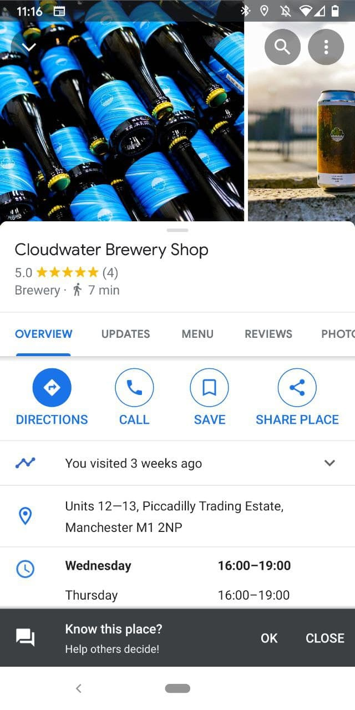]

]

--

.pull-right[


.img-smol[]

]


---

# Insight

--

.pull-left[

.img-smol[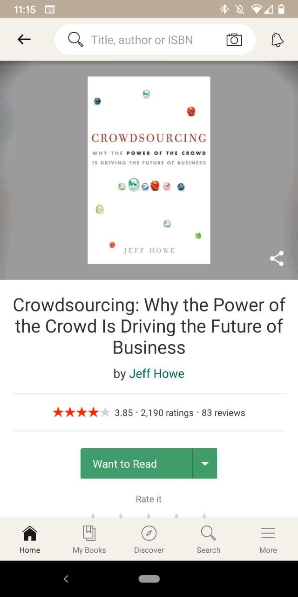]

]

--

.pull-right[

.img-smol[]

]

---
background-image: url("http://s2.narvii.com/image/dkcokotvsddr4scbcfldcurxxl3vjy46_00.jpg")
background-position: center
background-size: contain

---

background-image: url("https://fivethirtyeight.com/wp-content/uploads/2015/11/hickey-datalab-bestadaptations.png")
background-position: center
background-size: contain

---

class: center, middle, inverse


# How is this relevant for public safety?


---
class: center
# 3 key approaches

--
.middle[
### 1: found data
]
--

### 2: collected data

--

### 3: meta data


---

class: center, middle, inverse


# 1: Found data


---


### [safecity.in](https://safecity.in/)


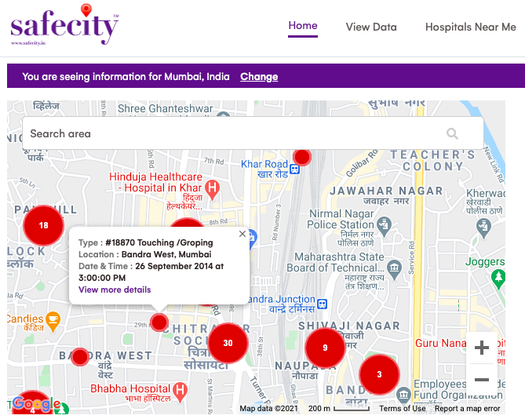


---
background-image: url("img/safecity_reps.png")
background-position: center
background-size: contain

# Web scraping to gather reports

---
# Identify risky situations

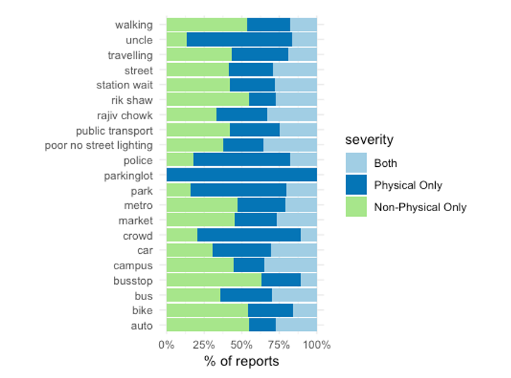


---

### [FixMyStreet](https://www.fixmystreet.com/)

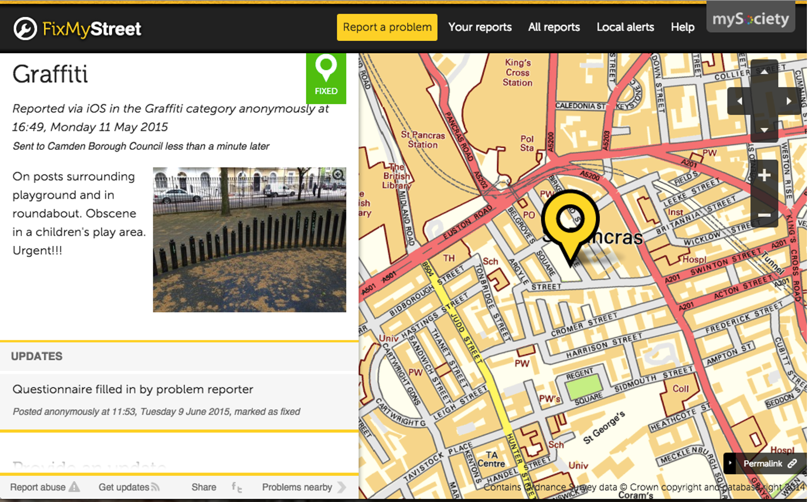

---
class: center, middle, inverse
background-image: url("img/fms_reps.png")
background-position: center
background-size: contain

# Web scraping to gather reports

---

background-image: url("img/fms_potholes.png")
background-position: center
background-size: contain

---

background-image: url("img/fms_graffiti.png")
background-position: center
background-size: contain

---

# Map experiences with disorder

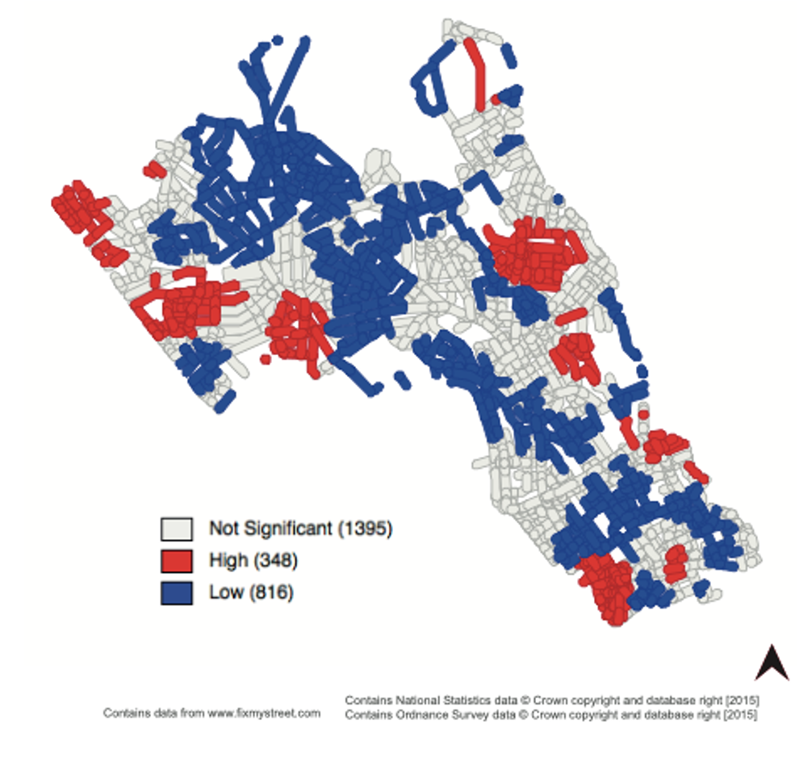

---

# Dynamic with time

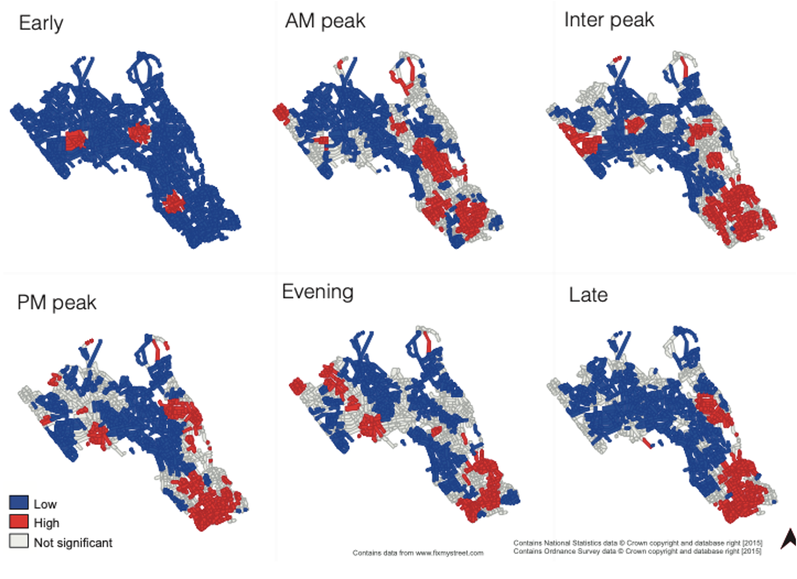
---
class: center, middle, inverse


# 2: Collected data

---

# Experience Sampling Method

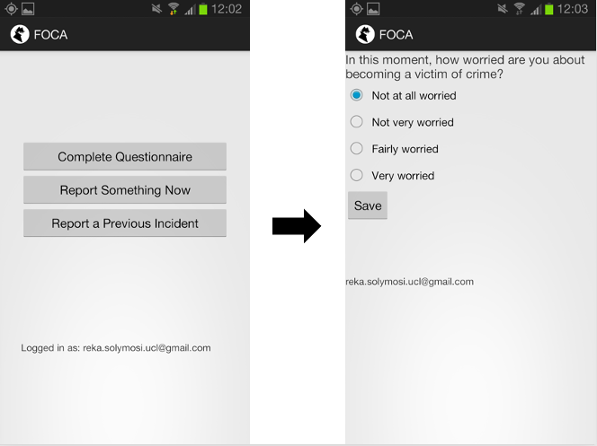

---

# In-context survey

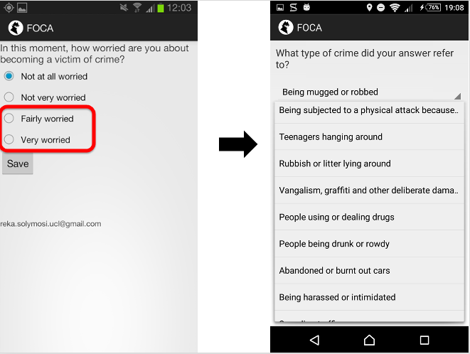
---
background-image: url("img/heresfoca.gif")
background-position: center
background-size: contain

---

background-image: url("img/focapopupmap.gif")
background-position: center
background-size: contain

---

# Spatial data on experiences

.img-smol[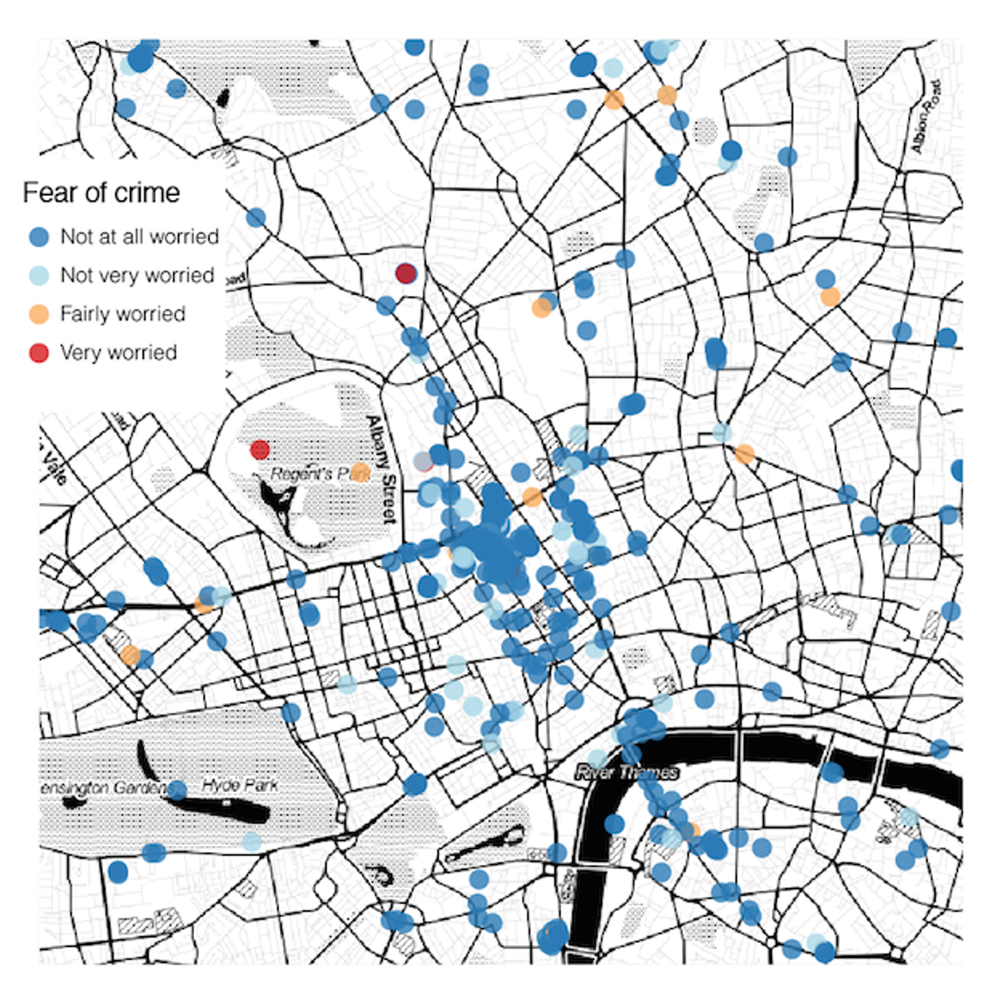]
---

# Additional dimensions (eg time)

.img-smol[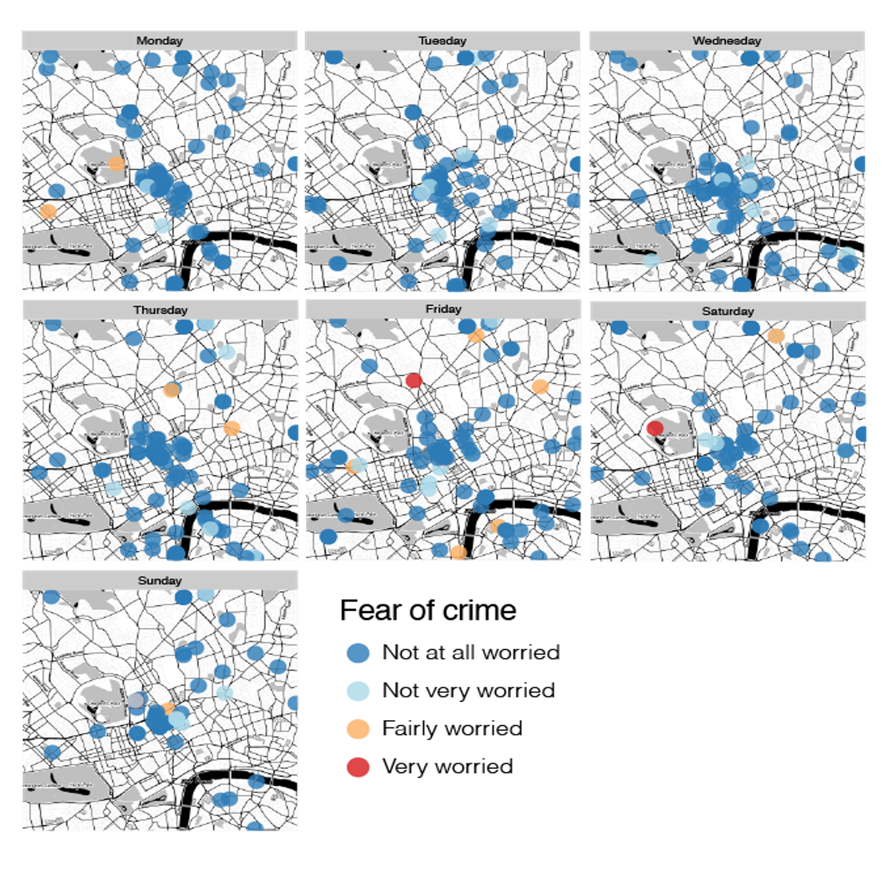]
---
class: center, middle, inverse


# 3: Meta data

---

# Study characteristics of the data 

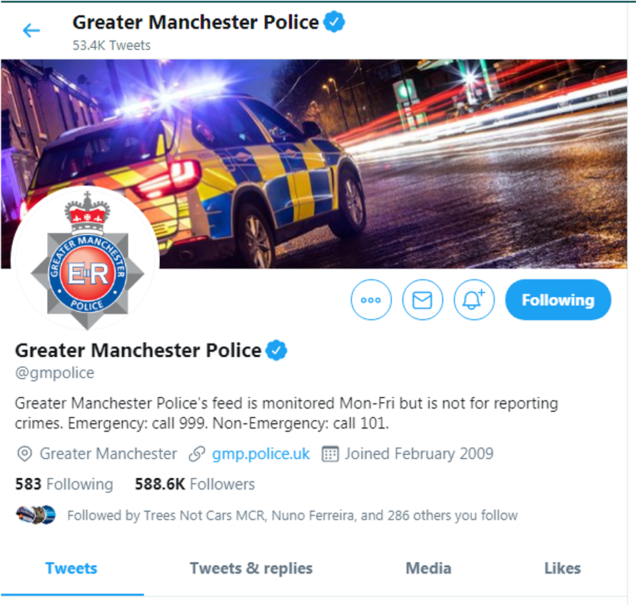
---

background-image: url("img/annotated_tweet.png")
background-position: center
background-size: contain
---

background-image: url("img/photoquality_tweets.png")
background-position: center
background-size: contain
---

background-image: url("img/template_tweet.png")
background-position: center
background-size: contain


---
class: center, middle, inverse


# Limitations

---

class: center
# 3 key issues

--
.middle[
### 1: bias
]
--

### 2: assumptions

--

### 3: ethics


---

# Bias

.bigger[

{{content}}

]

--

- Self-selection
{{content}}
  
--

- Unequal contribution (participation inequality)


---

## Participation inequality

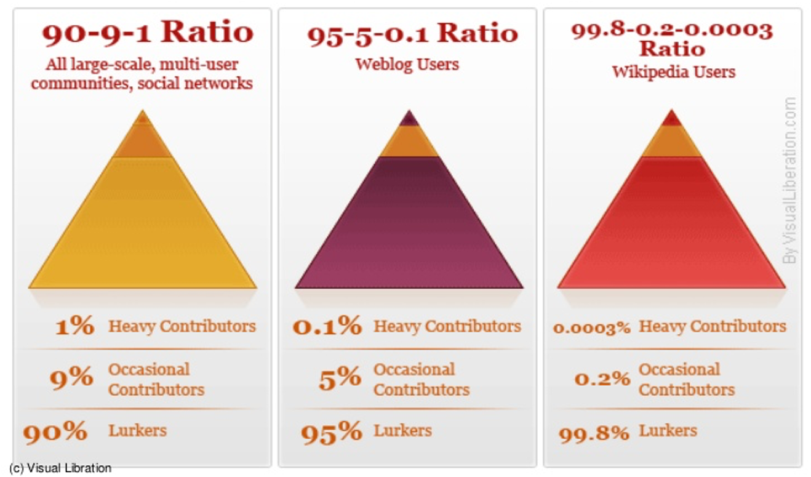

---

## FixMyStreet data

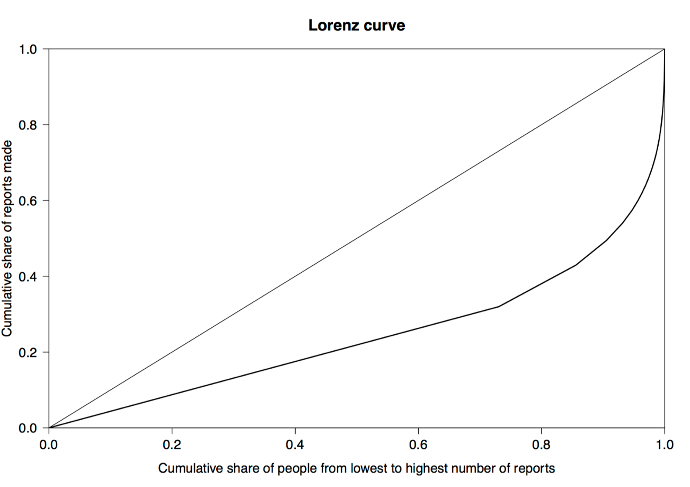

---


# Assumptions

.bigger[

{{content}}

]

--
- time of report = time of experience?
{{content}}
--

- inferred variables (e.g. demographics)
{{content}}
--

- shared understanding
  
  
---

background-image: url("img/fms_hotspot.png")
background-position: center
background-size: contain
---


background-image: url("img/coventgarden.png")
background-position: center
background-size: contain
---

background-image: url("img/abandonedvehicles.png")
background-position: center
background-size: contain
---

background-image: url("img/flyparking.png")
background-position: center
background-size: contain
---

# Ethics

.bigger[

{{content}}

]

--

- data ownership
{{content}}


--

- data linkage
{{content}}

--

- privacy/ surveillance
{{content}}

--

- implications of findings (service slanting)

---

# Summary

.bigger[

{{content}}

]
--
- many benefits of new forms of data
{{content}}
--

  + insight into experiences and behaviours
  {{content}}
--

  + spatial and temporal data
  {{content}}
--

  + large volumes/ low cost
  {{content}}
  
--
  
- key issues
{{content}}
--

  + representativeness / generalisability
  {{content}}
--

  + assumptions
  {{content}}
--

  + ethical issues

  


---

# Thank you

These slides: [https://rekadata.net/talks/newformsofdataforsafety.html](https://rekadata.net/talks/newformsofdataforsafety.html)

Questions? Contact by email: ([reka.solymosi@manchester.ac.uk](mailto:reka.solymosi@manchester.ac.uk)) or Twitter ([@r_solymosi](https://twitter.com/r_solymosi))

Further reading: 

.small[

  + [Solymosi, R., & Bowers, K. (2018). The role of innovative data collection methods in advancing criminological understanding. The Oxford Handbook of Environmental Criminology, 210, 210-237.](https://books.google.co.uk/books?hl=en&lr=&id=93BGDwAAQBAJ)
- [Solymosi, R., Buil-Gil, D., Vozmediano, L., & Guedes, I. S. (2020). Towards a place-based measure of fear of crime: A systematic review of app-based and crowdsourcing approaches. Environment and Behavior.](https://journals.sagepub.com/doi/full/10.1177/0013916520947114)
- [Buil-Gil, D, R Solymosi, and A Moretti (2020). Non-parametric bootstrap and small area estimation to mitigate bias in crowdsourced data. Simulation study and application to perceived safety. Big Data Meets Survey Science. Hill, C. A., Biemer, P. P., Buskirk, T., Japec, L., Kirchner, A. and Lyberg, L. E. (eds.). Wiley.](https://osf.io/preprints/socarxiv/8hgjt/)
+ [Langton, S., & Solymosi, R. (2020). Open Street Map for crime and place](https://doi.org/10.31219/osf.io/a96y7)
+ [Buil-Gil, D., & Solymosi, R. (2020) Using Crowdsourced Data to Study Crime and Place](https://osf.io/preprints/socarxiv/9ntk6/download)
+ [Solymosi, R., Petcu, O., & Wilkinson, J. (2020). Exploring public engagement with missing person appeals on Twitter. Policing and Society, 1-24.](https://www.tandfonline.com/doi/abs/10.1080/10439463.2020.1782409)


- Slides created via the R package [**xaringan**](https://github.com/yihui/xaringan). The chakra comes from [remark.js](https://remarkjs.com), [**knitr**](http://yihui.org/knitr), and [R Markdown](https://rmarkdown.rstudio.com).
]
