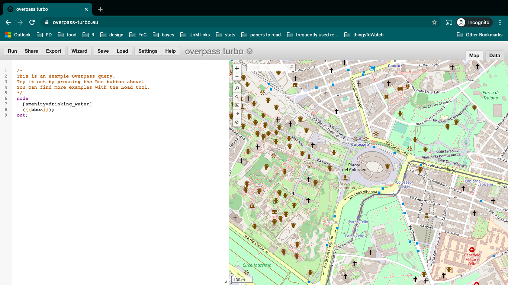
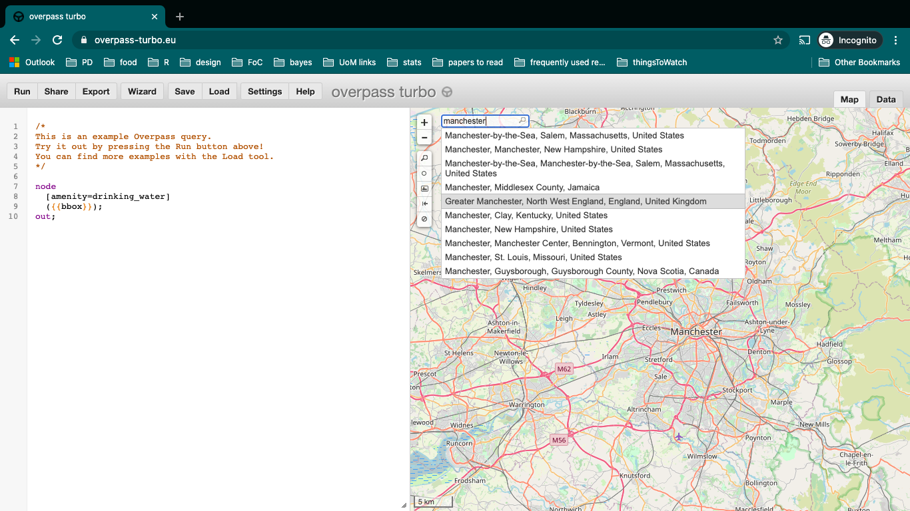
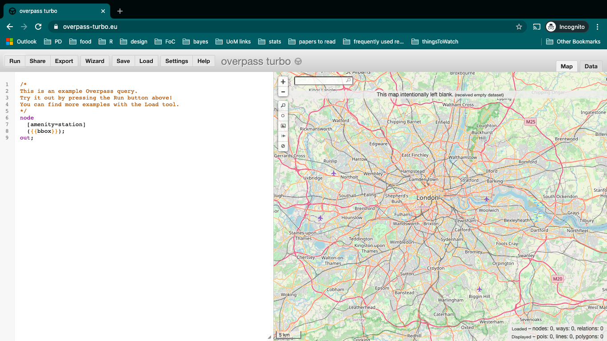

```{r setup, include=FALSE}
knitr::opts_chunk$set(echo = TRUE)
```

## Outline

- Introduction
- What are APIs? (some examples)
- Why use APIs?
- Exploring three ways to call data with APIs
    + Direct calls
    + Wrapper with graphical user interface
    + Wrapper in R package
- Questions/ discussion    

## Introduction

[https://rekadata.net/](https://rekadata.net/)

## What are APIs?

Application programming interface (API) is a tool which defines an interface for a program to interact with a software component, for example, what sort of requests or calls can be made to it, and how these can be made. Here, we are using the term 'API' to denote tools created by an open data provider to give access to different subsets of their content. Such APIs facilitate scripted and programmatic extraction of content, as permitted by the API provider [1](https://doi.org/10.1016/j.csi.2016.02.003). 


APIs can take many different forms and be of varying quality and usefulness [2](http://www.bigdatasocialscience.com/). For the purposes of accessing open data from the web, we are specifically talking about _RESTful_ APIs. The 'REST' stands for Representational State Transfer. These APIs work directly over the web. The computer asking for the data is called the client, and the computer sending the data back is known as a server. This dance is called the request-response cycle [3](https://www.twilio.com/blog/cool-apis). These web-based apis are nice because we can play with the API with relative ease in order to understand how it works [2](http://www.bigdatasocialscience.com/).


### Some examples

Here are some examples of data sets made available to request from using APIs, and some cool projects people have done with them. 


#### Twitter

- [Details](https://developer.twitter.com/en/docs/api-reference-index)
- [Some favorite student projects using the Twitter API](https://blog.twitter.com/developer/en_us/topics/community/2019/student-projects-using-the-Twitter-API-developer-blog.html)
- [tweetbotornot](https://github.com/mkearney/tweetbotornot)
- [Exploring public engagement with missing person appeals on Twitter](https://rekadata.net/blog/exploring-public-engagement-with-missing-person-appeals-on-twitter/)


#### Instagram

- [Details](https://www.instagram.com/developer/)
- [Instagram filters warning signs of depression](https://epjdatascience.springeropen.com/articles/10.1140/epjds/s13688-017-0110-z)
- [Manchester's Halloween Monsters](https://github.com/maczokni/halloweenMCR)
- [Commercial photo printing services](https://www.paperwave.com/all-products/)


#### Police.uk

- [Details](https://data.police.uk/docs/)
- [Stop and search by force](https://data.police.uk/docs/method/stops-force/)
- [Met stop and search dashboard](https://www.met.police.uk/sd/stats-and-data/met/stop-and-search-dashboard/)

#### NASA APIs

- [Details](https://api.nasa.gov/)
- [Retreive a picture from Mars Rover](https://www.twilio.com/blog/2017/04/texting-robots-on-mars-using-python-flask-nasa-apis-and-twilio-mms.html)


#### Spotify

- [Details](https://developer.spotify.com/documentation/web-api/)
- [Examples](https://developer.spotify.com/community/showcase/)

#### City Mapper

- [CityMapper](https://citymapper.com/manchester?set_region=uk-manchester)


## Why use APIs?

- Some data only accessible through API calls
- You get fresh data automatically
- Nearly any programming language can be used to access them (eg: Python, R, Java, JavaScript, Ruby, etc) 


## Exploring 3 ways to get data with APIs


### Direct call with URL

Make direct call with request usually in format of a URL


#### Transport for London API: 

- [About unified API](https://tfl.gov.uk/info-for/open-data-users/unified-api)
- [Documentation](https://api-portal.tfl.gov.uk/docs)


In the documentation there is an 'API area' (which offers some guidance on the types of data available). Scroll down and find the example calls for stops _Stops_. In the description you will  see that this call returns information on stops for busses or London Underground lines, and there are two examples (bus route 24 and the Bakerloo line).


Let's take their demonstration url you see for the bakerloo line: `https://api.tfl.gov.uk/line/bakerloo/stoppoints` and paste it into a web browser. 


Although this contains the information we requested, it is not very legible for our human eyes. It in a format called _JSON_. This stands for JavaScript Object Notation. JSON is an open standard way of storing and exchanging data, and will most likely be the format in which data are returned from most API calls. It is not intuitive to read in its current format but it is very machine readable friendly, in line with this requirement for open data. 


#### Exercise

Let's say instead we want data for the Northern Line. What do you think that URL will look like ?

Hint/reminder: the URL for the bakerloo line was:

`"https://api.tfl.gov.uk/line/bakerloo/stoppoints"`


#### Getting this data into R

In R, we can use the `fromJSON()` function from the `jsonlite` package and the `readLines()` function from base R to parse all this information into a data frame (with rows and columns). 

So we need now the URL from the exercise above: `"https://api.tfl.gov.uk/line/northern/stoppoints"` and to use readLines to get the request, and fromJSON to parse it

To keep things focused, let's request data about stop points on the Northern line, one of the largest and busiest on the network. Note how this is simply an amended version of the example provided by TfL in the API documentation.

```{r getapi}
library(jsonlite)

api_call <- fromJSON(readLines("https://api.tfl.gov.uk/line/northern/stoppoints"))
```

This gives us an object (`api_call`) which contains all the information returned by the TfL API.


JSON is slightly different to traditional data frames with rows and columns, which we are probably more familiar with, because the data are nested. For instance, `api_call` is classed as a data frame, but now try viewing the object using `View(api_call)`. 

Some of the columns are actually lists, rather than character or factor vectors, which is what we might usually expect. Another way of exploring the `api_call` object is by looping the `class()` function through all the columns in the data frame using `lapply(api_call, class)`. 

This demonstrates an important challenge faced by researchers when using open data, because dealing with data in this format can be messy and complicated. It is not always a neatly formatted data frame like a CSV file. However, with some data wrangling it is possible to extract the elements you need and move on to do some cool things. For example:


```{r northernlinetflmap, warning=FALSE, message=FALSE}
# load packages
library(dplyr)
library(sf)
library(ggplot2)

# transform api_call object by selecting name and coordinates and projecting to British National Grid
tfl_north_sf <- api_call %>% 
  select(commonName, lat, lon) %>% 
  st_as_sf(coords = c(x = "lon", y = "lat"), crs = 4326) %>% 
  st_transform(27700)

# plot the object with ggplot2 + sf
ggplot(tfl_north_sf) +
  geom_sf()
```

There we have it: with just a few lines of code in R, we have queried the TfL API, a public sector source of open data, and plotted stations on the Northern underground line.


### Wrapper with graphical user interface

In some cases you don't have to request directly by altering a string like the URL above, but can specify the parameters of your request using a _wrapper_. This is called a wrapper because it 'wraps' around the API to make it a neater, more usable way to acquire data.  In this way, wrappers may remove (or at least lower) many obstacles to accessing open data. 

In this case we will look first at a wrapper that uses a web interface that provides a graphical user interface (GUI) for accessing the API in question. Specifically we will explore the API for Open Street Map


#### Open Street Map API wrapper: Overpass Turbo


To demonstrate wrappers, we will access data from Open Street Map, a database of geospatial information built by a community of mappers, enthusiasts and members of the public, who contribute and maintain data about all sorts of environmental features, such as roads, green spaces, restaurants and railway stations, amongst many other things, all over the world. As such, it is a prime example of 'crowdsourced' open data. You can view the information contributed to Open Street Map using their online mapping platform (https://www.openstreetmap.org/). The result of people's contributions is a database of spatial information rich in local knowledge which provides invaluable information about places and their features, without being subject to strict terms on usage. 

Open Street Map (OSM) is currently on API vversion 0.6, originally deployed 17-21 April 2009. The API is currently accessible using the following URL: [https://api.openstreetmap.org/](https://api.openstreetmap.org/). Much like for the TfL API, which we could query without having to create any sort of login, we can query OSM data without authentication. However, all of the calls to the API which update, create or delete data have to be made by an authenticated and authorized user. 

To read more about the details of the OSM API see the [documentation](https://wiki.openstreetmap.org/wiki/API_v0.6). 


Open Street Map has two types of wrappers available for its API, a web-based GUI called Overpass Turbo (https://overpass-turbo.eu/), and an R package called `osmdata`. We start with Overpass Turbo. 


- [Overpass Turbo](https://overpass-turbo.eu/)


When you open the link it will give you an example: 





```{r eval = FALSE}

/*
This is an example Overpass query.
Try it out by pressing the Run button above!
You can find more examples with the Load tool.
*/
  
node
  [amenity=drinking_water]
  ({{bbox}});
out;

```


Overpass QL source code is divided into statements, and every statement ends with a semicolon ;. Statements are executed sequentially. Your query can contain any combination or number of OpenStreetMap [elements](https://wiki.openstreetmap.org/wiki/Elements) (nodes, ways, and relations).


When you make your query structured like the example above (`node[name="Foo"];`), you write into a default set. So then, when you're saving this default set, you save the result of your most recent query. If you wanted to save your result to a specific set, you must use the `->` syntax when that set name is prefixed with `.`.

For example:

  `node[name="Foo"]->._;`

The other thing specified in the example query above, is the area which you are interested in to search for drinking water amenities in. The shortcut `{{bbox}}` is used to take the bounding box of the map presented in the browser window as the current view as the boundary within which you want to perform your search. Another shortcut you might use is `{{center}}` which returns the center coordinates of the current view. If we wanted to specify the bounding box with coordinates instead, we can do so by specifying the four corners of our manually created bounding box in this order:

  `(bbox:south,west,north,east)`

How can we find these coordinates? There are a few ways, we will look at using R to get a bounding box later on, but there are other GUI-based tools for example [http://bboxfinder.com/](http://bboxfinder.com/) we can make use of as well. We can use this to navigate to Manchester for example, and come up with the following: 

  `(bbox: 53.368643,-2.534510,53.587675,-1.895244)`
  
So our query looks like: 

```{r, eval = FALSE}
/*
This is an example Overpass query.
Try it out by pressing the Run button above!
You can find more examples with the Load tool.
*/
  
node
  [amenity=drinking_water](bbox:53.368643,-2.534510,53.587675,-1.895244);
out;

```


This seems like a bit of work though, and instead, we can use the search bar on the map to find a location we're interested in. Here let's move to Manchester, and then run the query again so you can see drinking water availability in Manchester. 




#### Exercise

Now that pubs are open, why keep drinking water? Change the query to show you all the pubs in Manchester. 


#### Get Stations

Great, let's go back to our stops along the Northern Line in London then. Use the search bar to find London, get our bounding box from our map view again using the `{{bbox}}` shortcut, and search for "station". Well this returns nothing. We can see overpass turbo even tells us "map left intentionally blank": 





This is because there are no nodes that are amenities labelled station. So what can we do?

Features in Open Street Map are defined through 'keys' and 'values'. Keys are used to describe a broad category of features (e.g. highway, amenity), and values are more specific descriptions (e.g. cycleway, bar). These are tags which contributors to Open Street Map have defined. A useful way to explore these is by using the comprehensive [Open Street Map Wiki page on map features](https://wiki.openstreetmap.org/wiki/Map_Features). In this case there are no key-value pairs that match amenity-station. So what can we do to find the correct key-value pair?

To help build our queries, we can use the query _Wizard_. This is really helpful, but make sure you follow the [documentation](https://wiki.openstreetmap.org/wiki/Overpass_turbo/Wizard) when structuring your queries. Click on the 'Wizard' option and enter station in the textbox:


Now we finally have our stations:


We can play around with this, for example select only the nodes, and when we are happy, we can save the result using the 'Export' button. 


### Wrapper in R package

Not all wrappers are GUI-based, often they will come in the form of pre-packaged bits of code that facilitate the querying of APIs, making them more intuitive or broken down for better usability. For example, there are several R packages for getting Twitter data from the Twitter API such as [rtweet](https://cran.r-project.org/web/packages/rtweet/vignettes/intro.html), or Python modules for accessing the Instagram API such as [instaloader](https://instaloader.github.io/as-module.html). 

#### Open Street Map API wrapper: osmdata

In this case, let's stick with OSM, and make use of the R package `osmdata`. Similar to how we used overpass turbo, we can use the functions in this package to query the Open Street Map API, rather than the API query being made directly (like we did for TfL, using the URL). 


With the wrapper, besides checking out the API documentation, you have access to the package documentation and any associated vignettes online: [https://cran.r-project.org/web/packages/osmdata/vignettes/osmdata.html](https://cran.r-project.org/web/packages/osmdata/vignettes/osmdata.html). These can further guide our understanding of how to get the data we need. 

To get data with `osmdata`, we also build up a query, similar to overpass turbo. So the first thing we need to do is specify our bounding box. 

We can do this with the `getbb()` function from the `osmdata` package, which stands for "get bounding box". You can think of the bounding box as a box drawn around the area that we are interested in (in this case, London, England) which tells the Open Street Map API that we want everything *inside* the box, but nothing *outside* the box. Same as overpass turbo, but here we don't have a handy search bar.

So, how can we name a bounding box specification to define the study region? This can be obtained manually, like we did with the website [http://bboxfinder.com/](http://bboxfinder.com/), or with some existing knowledge about an area using the latitude and longitude coordinates, or we can make use of the ability to use a search term as a parameter of this `getbb()` function. 

To select Greater London, we can try the search term "greater london united kingdom". Besides specifying the study region, we can also tell the `getbb()` function what format we want the data to be in. In this case we want a spatial object, specifically an `sf` polygon object, which we name `bb_sf`. (This is relevant/interesting for the mapping part, so won't go super into it)

```{r bb}
library(osmdata)

bb_sf <- getbb(place_name = "greater london united kingdom", format_out = "sf_polygon")
```


We now have our study region defined as the administrative boundaries of Greater London. We can visualize this quickly to check that it has worked as expected using the `sf` and `ggplot2` packages. 

```{r bbmap}
library(ggplot2)
library(sf)

ggplot(data = bb_sf) +
  geom_sf()
```


Notice how this bounding box is not made up of only 4 points, but instead traces an outline around Greater London. This will be useful because although for our initial query the bounding box will be translated to the 4 points (essentially making up the actual plot box surrounding the London shape there), we can then use it again to filter only points within the outline of Greater London only. 


To build our query we use the `opq()` function, which stands for 'overpass query'. We need for this the bounding box (check), and we must also define the feature which we want to pull from the API. 


As we did with the GUI, we need to specify key-value pairs (we now know this will be `key = 'public_transport', value = 'station'`). So we can select what features we want using the `add_osm_feature()` function, specifying our key as 'public transport' and our value as 'station'. We also want to specify what sort of object (what class) to get our data into, and as we're still working with spatial data, we stick to the `sf` format, for which the function is `osmdata_sf()`. 


Finally, we trim everything down to our study region with the `trim_osmdata()` function. Without this addition, we would get points for everywhere within our bounding box, including some areas outside of Greater London. 

```{r opq}
osm_stat_sf <- opq(bbox = bb_sf) %>%                               # select bounding box
  add_osm_feature(key = 'public_transport', value = 'station') %>% # select features
  osmdata_sf() %>%                                                 # specify class
  trim_osmdata(bb_poly = bb_sf)                                    # trim by bounding box 
```

The resulting object `osm_stat_sf` contains lots of information. We can view the contents of the object by simply executing the object name into the **Console**.

```{r printstations}
osm_stat_sf
```


This confirms details like the bounding box coordinates, but also provides information on the features collected from the query. For example we see we have mostly nodes (points) but also some polygons. For now, let's extract the point information.


```{r stationpoints}
osm_stat_sf <- osm_stat_sf$osm_points 
```


We now have an `sf` object with all the public transport stations in London mapped by Open Street Map volunteers, along with over 130 variables of auxiliary data, such as the "fare_zone" the station is in, what "amenity" it may have and whether it has "toilets". 


Of course, it is up to the volunteers whether they collect all these data, and in many cases, they have not added information. Nevertheless, when the details are recorded, they provide rich insight and local knowledge that we may otherwise be unable to obtain.


One additional step needed is to select the stations which are relevant to us (i.e. they fall along the Northern Line). The variable `line` can help us with this. First, let's look at the values in this variable by using the `unique()` function: 


```{r valuesofline}

unique(osm_stat_sf$line)

```

You might see that the Northern line appears a few times, once as "Northern" but also once as "Northern City". We know that there is no line called "Northern City", and we can see that many other combinations of these values exist (e.g. "Circle;District" indicates that the station serves both Circle and District lines). Therefore, we can assume that stations like "Northern City" serve both the Northern line and one other. To get round this, and select all stations with "Northern" somewhere in the name, we can use the `grepl()` function from base R. Note that we also make use of `filter()` from within `dplyr`, so we first need to load that package.

```{r filterline}
library(dplyr)

osm_north_sf <- osm_stat_sf %>% 
  filter(grepl("Northern", line))
```


Finally we can now map our points for the stations along the Northern Line from both the TfL API and the Open Street Map API: 


```{r}

ggplot() +
  geom_sf(data = tfl_north_sf, col = 'red', alpha = 0.7) +
  geom_sf(data = osm_north_sf, col = 'blue', alpha = 0.7)
  

```


#### Exercise

They are not the same. Why do you think this? Discuss!


## The end

Thank you very much, any questions please get in touch, either via twitter [\@r_solymosi](https://twitter.com/r_solymosi) or by email: reka.solymosi\@manchester.ac.uk


