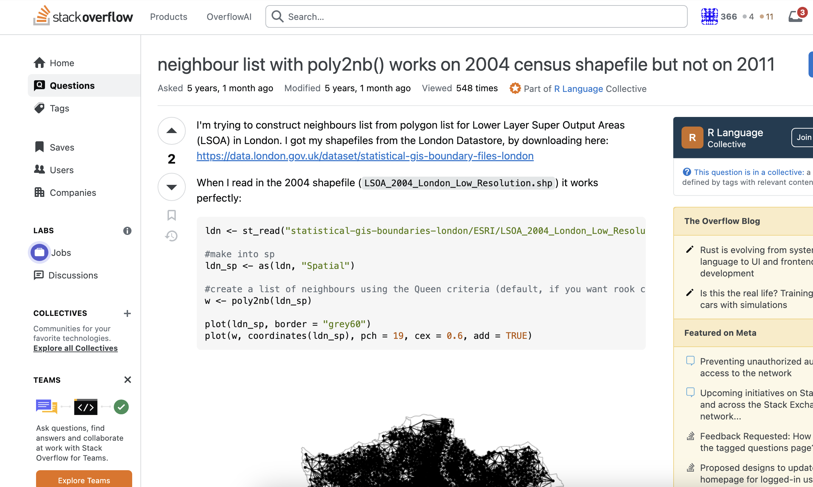
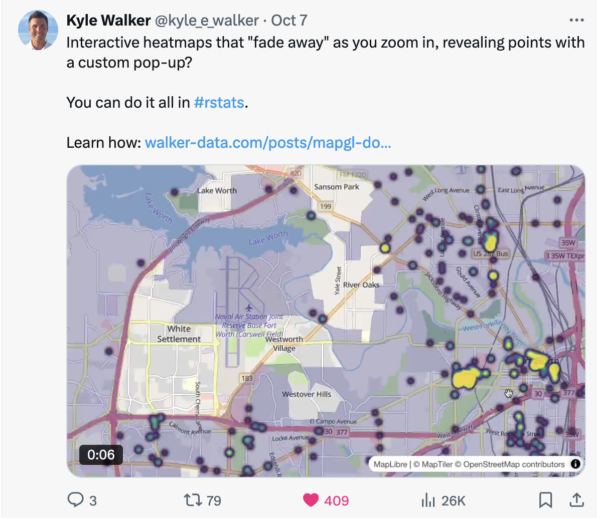
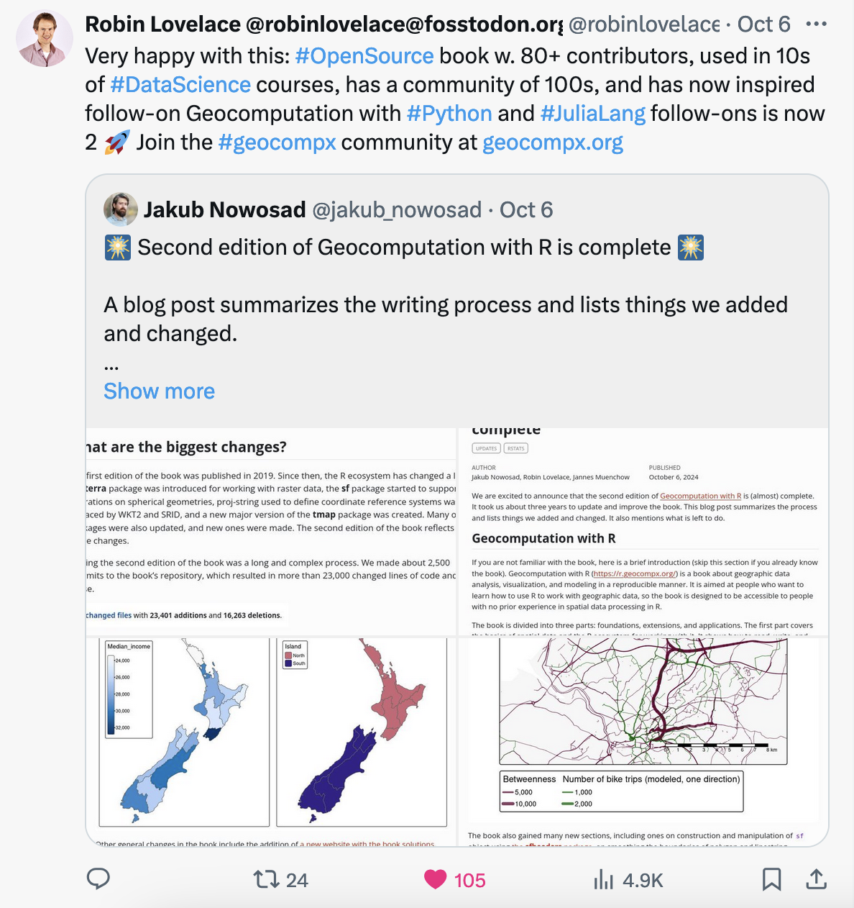
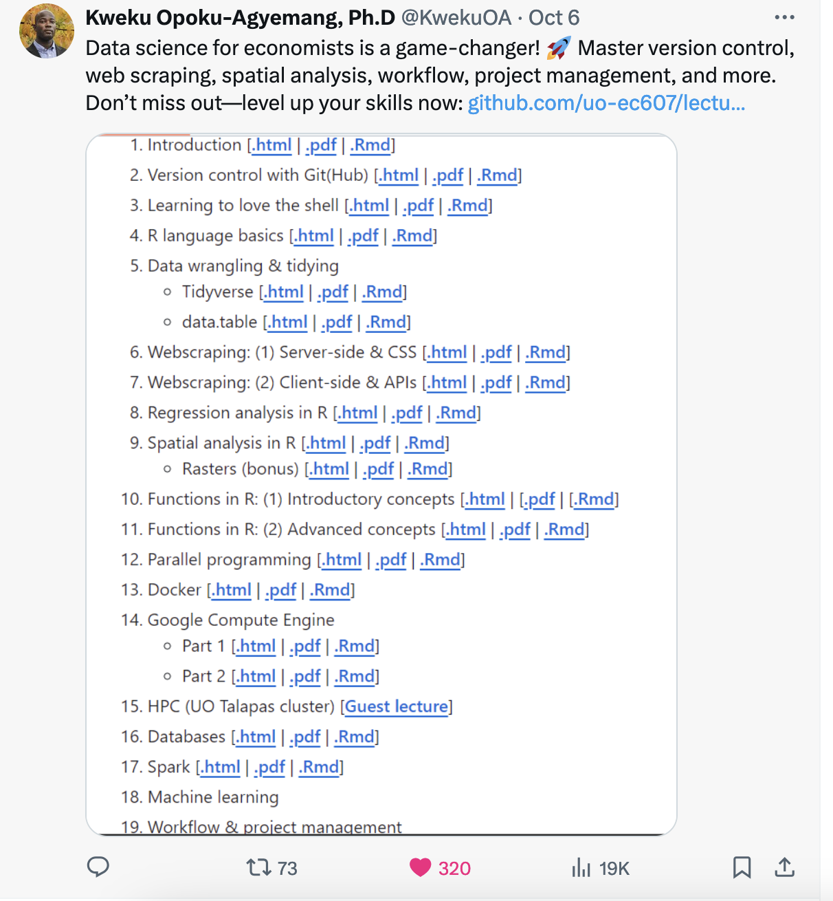
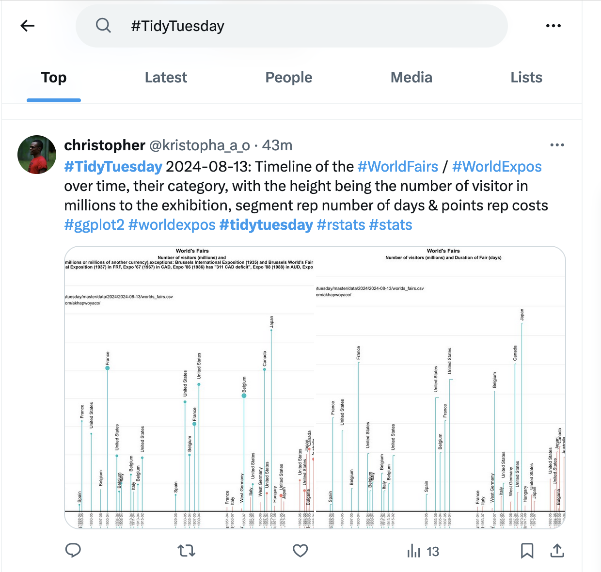
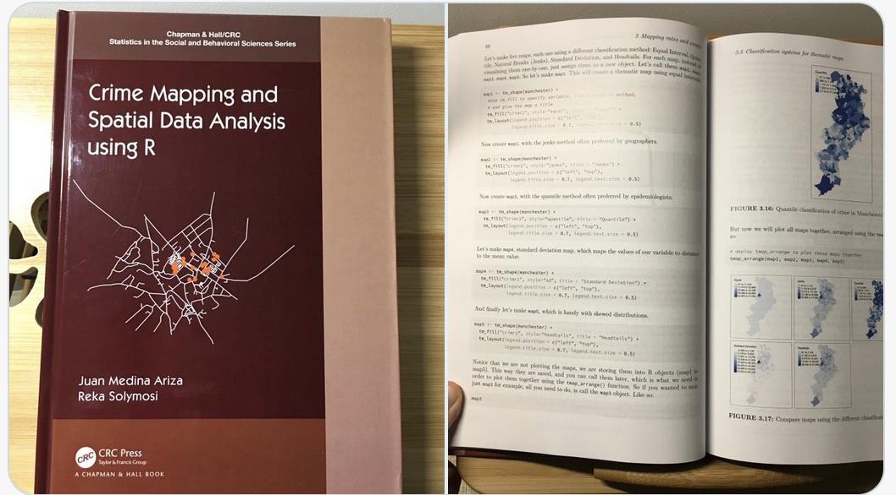

```{r setup, include=FALSE}
options(htmltools.dir.version = FALSE)
knitr::opts_chunk$set(fig.path   = "figures/",
                      fig.width  = 4.2,
                      fig.height = 4.0,
                      fig.retina = 2,
                      warning = FALSE,
                      error = FALSE,
                      message = FALSE)

theme_uom <- function () { 
  theme_minimal(base_size=14, base_family="Arial") %+replace% 
    theme(
      axis.ticks = element_line(colour = "white",size=0.25),
      text = element_text(colour = "white"),
      axis.text  = element_text(colour = "white"),
      panel.background  = element_rect(colour = "white",fill="#660099"),
      plot.background = element_rect(colour = "white",fill="#660099"),
      legend.position = "bottom",
      legend.title = element_blank(),
      panel.grid.minor = element_blank(),
      panel.grid.major.x = element_line(colour = "white",size=0.25),
      panel.grid.major.y = element_line(colour = "white",size=0.25),
      legend.text = element_text(size = 14)
    )
}


```
class: title-slide  

.container[
.UoM-right[

# R Software in Criminological Research: Benefits of an Open Source Framework
## 
## Réka Solymosi
## Department of Criminology
## University of Manchester
## reka.solymosi@manchester.ac.uk

]


.left-plot-title[

```{r logo, echo=FALSE}

```
]
]

---
# Overview


- Brief introduction to the importance of data analysis in criminology 

--

- Overview of R as an open-source programming language and software environment 

--

- Advantages of R 

--

- Examples of utility 

--

- How to get started 

--

- Practice example 

--

- Q & A 


---

# The importance of data analysis in criminology

--

- Academic Research and Theoretical Development

--

- Understanding Crime Patterns

--

- Informed Decision-Making

--

- Evaluation of Criminal Justice Policies

--

- Interdisciplinary Applications

--

- and so on... 

---

# So why R?

---

# Reason 1: Open source 

---

## Free (accessible)

- For students, teachers, professionals
- No licence required
- Download R: [https://www.r-project.org/](https://www.r-project.org/)
- Download R Studio (IDE): [https://posit.co/downloads/](https://posit.co/downloads/)

---

## Many contributors (range of packages)

- Any type of analysis you want to do - it is possible
- Anyone can contribute
- If it doesn't exist, someone will write it


```{r crimpkgs, echo=FALSE, out.width="49%"}
knitr::include_graphics(c("figures/sppt.png",
                          "figures/synthetic-crime.png", 
                          "figures/crimedata.png", 
                          "figures/aoristic.png"))
```

---

## Community support

```{r stackoverflowimg, echo=FALSE, out.width='60%'}

```

[https://stackoverflow.com/questions/57675328/neighbour-list-with-poly2nb-works-on-2004-census-shapefile-but-not-on-2011](https://stackoverflow.com/questions/57675328/neighbour-list-with-poly2nb-works-on-2004-census-shapefile-but-not-on-2011)

---

## Community support


```{r twitter1, echo=FALSE, out.width='60%'}

```

---

## Community support


```{r twitter2, echo=FALSE, out.width='60%'}

```

---

## Community support


```{r twitter3, echo=FALSE, out.width='60%'}

```

---

## Community support


```{r twitter4, echo=FALSE, out.width='60%'}

```


---

# Reason 2: Versatile 

---

## Data

```{r crimedata}
library(fivethirtyeight)

head(hate_crimes)

```

---

## Analysis 

```{r eda1, eval=FALSE}
library(skimr)
skim(hate_crimes)
```

```{r eda1_print, eval=TRUE, echo=FALSE}
library(skimr)
library(dplyr)
results <- skim(hate_crimes)
knitr::kable(head(results %>% select(skim_variable, n_missing, numeric.mean, numeric.hist) %>% filter(skim_variable!="state_abbrev"))) %>% 
kableExtra::kable_styling(stripe_color = "#FFCC33")

```

---

## Summary stats

```{r}

summary_hate_crimes <- summary(hate_crimes$hate_crimes_per_100k_splc)
summary_hate_crimes

```

---

## T-test

```{r}

# Create a new variable to categorise states
hate_crimes$income_category <- ifelse(hate_crimes$median_house_inc > median(hate_crimes$median_house_inc), "High", "Low")

# Perform a t-test
t_test_result <- t.test(hate_crimes$hate_crimes_per_100k_splc ~ hate_crimes$income_category)
t_test_result

```

---

## Missing values

```{r}
missing_values <- sum(is.na(hate_crimes$hate_crimes_per_100k_splc))
missing_values

```

---

## Calculate correlation

```{r}

correlation <- cor.test(hate_crimes$median_house_inc, 
                   hate_crimes$hate_crimes_per_100k_splc, 
                   use = "complete.obs", 
                   method = "pearson")

correlation
```
---

## Calculate regression

```{r}

# Fit a linear regression model
model <- lm(hate_crimes_per_100k_splc ~ median_house_inc + 
              share_vote_trump + 
              share_non_citizen, 
            data = hate_crimes)

summary(model)

```

---

## Present results nicely

```{r}

library(broom)

# Tidy the model results
tidy_model <- tidy(model)

# Print the tidy model as an HTML table
tidy_model %>%
  knitr::kable("html", caption = "Regression Results") %>%
  kableExtra::kable_styling(full_width = FALSE)

```


---

```{r, echo=FALSE}
library(ggplot2)
```


```{r}

library(sjPlot)
# Create a forest plot for the regression model
plot_model(model, type = "est", show.values = TRUE, show.ci = TRUE) +
  labs(title = "Forest Plot of Regression Coefficients", x = "Estimate", y = "Predictors")


```

---

## Many types of analysis

---

## Network
.container[
.left-plot[
```{r networkexample, fig.show='hide'}

# Load the libraries
library(igraph)
library(igraphdata)

# Load a sample network dataset
data("USairports")

# Plot the network graph
plot(USairports, 
     vertex.size=5, 
     vertex.label=NA, 
     edge.arrow.size=0.3, 
     main="US Airports Network")
```
]

.right-plot[
`)
]
]
---

##Spatial
.container[
.left-plot[
```{r spatialexample, fig.show='hide'}
# Load the library
library(tmap)

# Load the inbuilt dataset
data("World")

# Create a quick map
tm_shape(World) + 
  tm_polygons("pop_est", 
              title = "Population") +
  tm_layout(main.title = "World Population Map", 
            frame = FALSE)

```
]

.right-plot[
`)
]
]
---

## Text 
.container[
.left-plot[
```{r textexample, fig.show='hide'}

# Load the libraries
library(wordcloud)
library(tm)

# Load a sample text dataset
data("crude")

# Create a term-document matrix
tdm <- TermDocumentMatrix(crude)

# Convert the matrix to a format for word cloud
m <- as.matrix(tdm)
word_freq <- sort(rowSums(m), 
                  decreasing=TRUE)

# Generate the word cloud
wordcloud(names(word_freq), 
          word_freq, max.words=100)

```
]

.right-plot[
`)
]
]
---

## Machine learning 
.container[
.left-plot[
```{r mlexample, fig.show='hide'}
# Load the libraries
library(rpart)
library(ggparty)

# Load the dataset
data(iris)

# Create a decision tree model using rpart directly
model <- rpart(Species ~ ., data = iris)

```
]

.right-plot[
```{r mlexampleplot, echo = F}
# Convert the rpart object into a party object
party_model <- as.party(model)

# Plot the tree using ggparty
ggparty(party_model) + 
  geom_edge() + 
  geom_edge_label() + 
  geom_node_label(aes(label = splitvar), ids = "inner") +
  geom_node_label(aes(label = info), ids = "terminal") +
  theme_uom()

```
]
]

---

## More ML

.container[
.left-code[
```{r mlexample2, fig.show='hide'}
library(caret)
# Load the iris dataset
data(iris)

# Split the data into training and testing sets (70% training, 30% testing)
set.seed(123)
trainIndex <- createDataPartition(iris$Species, p = 0.7, list = FALSE)
trainData <- iris[trainIndex, ]
testData <- iris[-trainIndex, ]

# Train a KNN model
model <- train(Species ~ ., data = trainData, method = "knn", tuneLength = 5)

# Predict on the test data
predictions <- predict(model, testData)

# Evaluate the model with a confusion matrix
confusionMatrix(predictions, testData$Species)
```
]

.right-plot[

`)

]
]
---

## Sentiment analysis

.container[
.left-plot[
```{r sentiexample, fig.show='hide'}
# Load the libraries
library(tidytext)
library(janeaustenr)
library(dplyr)
library(ggplot2)

# Load the dataset and convert it to a tidy format
data("austen_books")
tidy_books <- austen_books() %>%
  unnest_tokens(word, text)

# Perform sentiment analysis using the Bing lexicon
sentiments <- tidy_books %>%
  inner_join(get_sentiments("bing")) %>%
  group_by(book, sentiment) %>% 
  count()

```
]


.right-plot[

```{r sentiexplot, echo=FALSE}
# Plot the results
ggplot(sentiments, aes(x = book, y = n, fill = sentiment)) +
  geom_bar(stat = "identity", position = "dodge") +
  labs(title = "Sentiment Analysis of Jane Austen's Books", 
       x = "Book", 
       y = "Count of Words with each Sentiment") +
  theme_uom() + 
    theme(axis.text.x = element_text(angle = 45, hjust = 1))
```

]
]
---

## Plotting 

---

.container[
.left-plot[
```{r scatter1, fig.show='hide'}
# Load necessary library
library(ggplot2)

# Basic scatter plot
ggplot(hate_crimes, 
       aes(x = median_house_inc, 
           y = hate_crimes_per_100k_splc)) +
  geom_point() +
  labs(title = "Hate Crimes vs. Income",
       x = "Median Household Income",
       y = "Hate Crimes per 100k") +
  theme_minimal()

```
]
.right-plot[
`)
]
]
---

.container[
.left-plot[
```{r scatter2, fig.show='hide'}
# Scatter plot with colour
ggplot(hate_crimes, 
       aes(x = median_house_inc, 
           y = hate_crimes_per_100k_splc, 
           color = share_pop_metro)) +
  geom_point() +
  labs(title = "Hate Crimes vs.Income",
       x = "Median Household Income",
       y = "Hate Crimes per 100k",
       color = "Population Share (Metro)") +
  theme_minimal() +
  scale_color_gradient(low = "#FFCC33", 
                       high = "#660099")
```

]
.right-plot[
`)
]
]

---

.container[
.left-plot[
```{r scatter3, fig.show='hide'}
# Scatter plot with regression line
ggplot(hate_crimes, 
       aes(x = median_house_inc, 
           y = hate_crimes_per_100k_splc, 
           color = share_pop_metro)) +
  geom_point() +
  geom_smooth(method = "lm", 
              se = FALSE, 
              color = "black") +
  labs(title = "Hate Crimes vs.Income",
       x = "Median Household Income",
       y = "Hate Crimes per 100k",
       color = "Population Share (Metro)") +
  theme_minimal() +
  scale_color_gradient(low = "#FFCC33", 
                       high = "#660099")

```

]
.right-plot[
`)
]
]

---
.container[
.left-plot[

```{r scatter4, fig.show='hide'}

# add faceting
ggplot(hate_crimes, 
       aes(x = median_house_inc, 
           y = hate_crimes_per_100k_splc, 
           color = share_pop_metro)) +
  geom_point() +
  geom_smooth(method = "lm", 
              se = FALSE, 
              color = "black") +
  labs(title = "The importance of Trump Voters",
       x = "Median Household Income",
       y = "Hate Crimes per 100k",
       color = "Population") +
  theme_minimal() +
  scale_color_gradient(low = "#FFCC33", 
                       high = "#660099") +
  facet_wrap(~ cut(share_vote_trump, 
                   breaks = c(-Inf, 0.4, 0.6, 
                              0.8, 1), 
                   labels = c("Low", "Medium", 
                              "High", "Very High")), 
               labeller = label_both)


```
]
.right-plot[
`)
]
]
]

---
.container[
.left-plot[
```{r scatter5, fig.show='hide'}

mean_hc <- mean(hate_crimes$hate_crimes_per_100k_splc, 
                               na.rm = TRUE)
mean_inc <- mean(hate_crimes$median_house_inc, 
                 na.rm = TRUE)
ggplot(hate_crimes, 
       aes(x = median_house_inc, 
           y = hate_crimes_per_100k_splc, 
           color = share_pop_metro)) +
  geom_point(size = 3, 
             alpha = 0.6) +
  geom_smooth(method = "lm", 
              se = FALSE, 
              color = "black", 
              linetype = "dashed") +
  labs(title = "Hate Crimes vs. Income",
       x = "Median Household Income",
       y = "Hate Crimes per 100k",
       color = "Population Share (Metro)") +
  theme_minimal() +
  scale_color_gradient(low = "#FFCC33", 
                       high = "#660099") +
  theme(plot.title = element_text(hjust = 0.5, 
                                  size = 14),
        axis.title = element_text(size = 12),
        legend.position = "bottom") +
  geom_hline(yintercept = mean_hc, 
             linetype = "dotted", 
             color = "grey") +
  geom_vline(xintercept = mean_inc, 
             linetype = "dotted", 
             color = "grey")


```

]
.right-plot[
`)
]
]
]

---

# Reason 3: Reproducibility

---

## For open science

--

- **Enhances Transparency:** Open science promotes transparency in research methods and data, allowing for better scrutiny and validation of findings.

--

- **Fosters Collaboration:** Sharing data and methodologies encourages collaboration among criminologists, leading to more comprehensive studies.

--

- **Accelerates Innovation:** Open access to research can accelerate the development of new theories and approaches in criminology.

--

- Key Resources
  - **CrimRxiv:** An open-access preprint repository for the criminology community: [https://www.crimrxiv.com/](https://www.crimrxiv.com/) 
  - **Open Science Working Group at the ESC:**[https://esc-enoc.github.io/](https://esc-enoc.github.io/)


---

## For yourself (e.g., changes for reviewer or repeat analysis/batch processing)

.container[
.left-plot[
```{r scatterbw, fig.show='hide'}
# Scatter plot with regression line
ggplot(hate_crimes, 
       aes(x = median_house_inc, 
           y = hate_crimes_per_100k_splc, 
           color = share_pop_metro)) +
  geom_point() +
  geom_smooth(method = "lm", 
              se = FALSE, 
              color = "black") +
  labs(title = "Hate Crimes vs.Income",
       x = "Median Household Income",
       y = "Hate Crimes per 100k",
       color = "Population Share (Metro)") +
  theme_minimal() +
  scale_color_gradient(low = "grey90", 
                       high = "black")

```

]
.right-plot[
`)
]
]

---

## Less point and click = more transparency, less space for errors 

- In 2010, economists Carmen Reinhart and Kenneth Rogoff published a paper titled "Growth in a Time of Debt."
- The paper claimed that countries with debt levels above 90% of GDP experienced slower economic growth.
- A spreadsheet error in their data analysis led to faulty conclusions.
- The findings influenced austerity measures globally, including in the EU and the US.
- Policymakers used the conclusions to justify harsh budget cuts and economic policies.
- See: [https://www.bbc.com/news/magazine-22223190](https://www.bbc.com/news/magazine-22223190)

---

## Beyond analysis...

--
- Slides/ reporting (demo next)

--
- Websites

--
- Books

---

## Is it R? 

```{r echo=FALSE, out.width='20%'}


```

--
- these slides?

--
- [rekadata.net](https://rekadata.net/)

--
- [This ESC presentation](http://lesscrime.info/talk/esc-stadia-2024/)

--

- This book

```{r crimbook, echo=FALSE, out.width='40%'}

```

---

## Getting Started with R

- **[R for Data Science](https://r4ds.had.co.nz/)**: A free online book that’s an excellent resource for learning R and data science workflows.
- **[Hands-On Programming with R](https://rstudio-education.github.io/hopr/)**: Friendly intro to R language for non-programmers
- **[DataCamp: Introduction to R](https://www.datacamp.com/courses/free-introduction-to-r)**: Free course offering an interactive way to learn R basics.

## Visualisation

- **[Data Visualization: A practical introduction](https://socviz.co/)**: Beautiful book on data visualisation
- **[ggplot2: Elegant Graphics for Data Analysis](https://ggplot2-book.org/)**: A resource for those interested to understand the logic of the Grammar of Graphics that ggplot2 uses.
  
## R Resources for Criminology/ Social Science


- **[Quantitative Social Science: An Introduction](https://press.princeton.edu/books/paperback/9780691175461/quantitative-social-science)**: My favourite social science stats textbook - also uses R
- **[Discovering Statistics Using R](https://uk.sagepub.com/en-gb/eur/discovering-statistics-using-r/book236067)**: Very comprehensive, from field of psychology
- **[A Beginner’s Guide to Statistics for Criminology and Criminal Justice Using R](https://link.springer.com/book/10.1007/978-3-030-50625-4)**: Written as a companion to classic stats book by Weisburd and Britt
- **[R for Criminologists](https://maczokni.github.io/R-for-Criminologists/)**: Our course material for PGT
- **[R for Criminologists](https://uom-resquant.github.io/modelling_book/)**: Our course material for UG


---

## Additional Learning

- **[Stack Overflow](https://stackoverflow.com/questions/tagged/r)**: Get help from the R community by browsing or asking questions.
- **[R Bloggers](https://www.r-bloggers.com/)**: Collection of blogs about using R in a variety of disciplines, including criminology.
- Twitter (or maybe Blue Sky now? I don't know!!!)

---

# Demo 

---

## Exercise

Code to copy:

```{r exercise_setup, eval = FALSE}

# Install necessary packages if they are not already installed
if(!require(ggplot2)) 
  install.packages("ggplot2", dependencies = TRUE)
if(!require(fivethirtyeight)) 
  install.packages("fivethirtyeight", dependencies = TRUE)

# Load the packages
library(ggplot2)
library(fivethirtyeight)

# Create a basic scatter plot of median_house_inc vs. hate_crimes_per_100k_splc
ggplot(hate_crimes, 
       aes(x = median_house_inc, 
           y = hate_crimes_per_100k_splc)) +
  geom_point(color = "blue", 
             size = 3, 
             alpha = 0.6) +  # Scatter plot with blue points
  labs(title = "Hate Crimes per 100k vs. Median Household Income",
       x = "Median Household Income",
       y = "Hate Crimes per 100k") +
  theme_minimal()  # Apply minimal theme for a clean look

```


---


## Exercise 1: Change the Aesthetics

- **Task:** Modify the color, size, or transparency of the points in the scatter plot.
- **Hint:** Use color, size, and alpha arguments in geom_point().

--

**Answer: **
```{r exercise1, eval = FALSE}

# Modify color and size of points
ggplot(hate_crimes, aes(x = median_house_inc, 
                        y = hate_crimes_per_100k_splc)) +
  geom_point(color = "red", size = 5, alpha = 0.8) +  
  labs(title = "Modified Scatter Plot", 
       x = "Median Household Income", 
       y = "Hate Crimes per 100k") +
  theme_minimal()

```


---


## Exercise 2:  Add a Regression Line

- **Task:** Add a linear regression line to the scatter plot to show the trend.
- **Hint:** Use geom_smooth() with method = "lm" to add a linear model.

--

**Answer: **
```{r exercise2, eval = FALSE}

# Scatter plot with a regression line
ggplot(hate_crimes, 
       aes(x = median_house_inc, 
           y = hate_crimes_per_100k_splc)) +
  geom_point(color = "blue", size = 3, alpha = 0.6) +
  geom_smooth(method = "lm", color = "black", se = FALSE) +  
  labs(title = "Scatter Plot with Regression Line", 
       x = "Median Household Income", 
       y = "Hate Crimes per 100k") +
  theme_minimal()

```


---


## Exercise 3:  Group Points by a Third Variable

- **Task:** Color the points by a third variable such as share_pop_metro to explore how urban/rural distribution affects the relationship.
- **Hint:** Use color = share_pop_metro inside the aes() function.

--

**Answer: **
```{r exercise3, eval = FALSE}

# Scatter plot with points colored by share_pop_metro
ggplot(hate_crimes, 
       aes(x = median_house_inc, 
           y = hate_crimes_per_100k_splc, 
           color = share_pop_metro)) +
  geom_point(size = 3, alpha = 0.6) +
  labs(title = "Scatter Plot by Population",
       x = "Median Household Income", 
       y = "Hate Crimes per 100k", 
       color = "Share Pop Metro") +
  theme_minimal() +
  scale_color_gradient(low = "blue", high = "red")

```


---


## Exercise 4:  Customize the Plot Theme

- **Task:** Explore different ggplot2 themes such as theme_classic(), theme_bw(), or even modify axis titles, labels, and legend positions.
- **Hint:** Use theme() to customize the plot or apply pre-built themes like theme_classic().

--

**Answer: **
```{r exercise4, eval = FALSE}

# Custom theme applied to scatter plot
ggplot(hate_crimes, aes(x = median_house_inc, y = hate_crimes_per_100k_splc, color = share_pop_metro)) +
  geom_point(size = 3, alpha = 0.6) +
  labs(title = "Scatter Plot with Custom Theme",
       x = "Median Household Income", y = "Hate Crimes per 100k", color = "Share Pop Metro") +
  theme_classic() +
  theme(plot.title = element_text(hjust = 0.5, size = 14),
        axis.title = element_text(size = 12),
        legend.position = "bottom")

```

---

## Thank you

Contact: reka.solymosi@manchester.ac.uk
