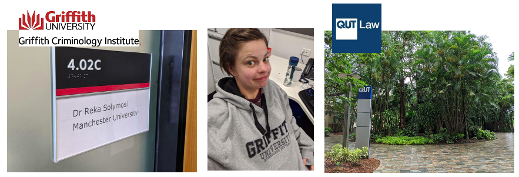
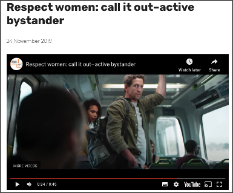
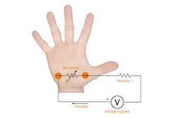

```{r setup, include=FALSE}
knitr::opts_chunk$set(echo = FALSE)
```


# About Me

- Research: Crime, victimisation, transport, missing persons
- Teaching: Data analysis, GIS 
- Loves: R, transport, data visualisations, walking, eating
- Twitter: @r_solymosi
- Website: rekadata.net

# How did I get to Brisbane?


... A long long time ago in a galaxy far far away... 


# I got funding to spend my research leave in Australia!

```{r fig.align="center", echo=FALSE}
   
```

# Bystander intervention in sexual harassment

The Project: How do victims of sexual harassment perceive ‘indirect’ intervention by bystanders?

***

```{r fig.align="center", echo=FALSE}
   
```


# Exciting research design


```{r fig.align="center", echo=FALSE}
   
```

--

```{r fig.align="center", echo=FALSE}
   knitr::include_graphics('img/scenario_2.gif')
```

# Project progress

--
✓ Ethics approval
--
✓ Scenarios written and filmed
--
✓ VR lab booked
--
✓ GSR sensor and questionnaires ready
--
X Data collection with pilot participants


