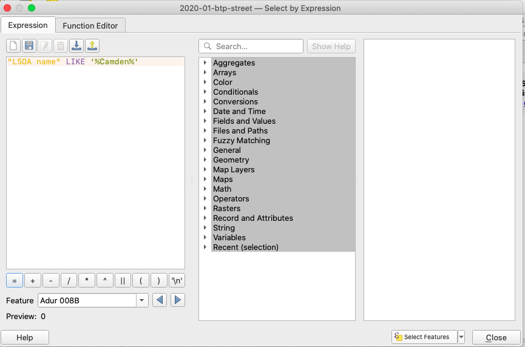

```{r setup, include=FALSE}
knitr::opts_chunk$set(echo = TRUE)
```

Welcome to the course page for Crowdsourced and social media data for research Seminar for the course AG2130 at KTH. On this page I have the materials for the lab sessions where you will follow a guided example in QGIS to gain the following experiences: 


- Find and download relevant crowdsourced data from Open Street Map using the API query tool OverpassTurbo 
- Load the data into QGIS
- Map the data and draw conclusions about substantive topics 
- Query the Twitter API to obtain Twitter data using Qweetgis plugin
- Map the Twitter data in QGIS and overlay onto Open Street Map layer
- Produce a legible map for sharing findings

I hope that you enjoy this exercise. The material will remain online for you to access, and myself or Oskar will be around in the lab session to ansewr any of yoru questions. If you have questions outside of this time, please do not hesitate to get in touch, my email is [reka.solymosi@manchester.ac.uk](mailto:reka.solymosi@manchester.ac.uk). 


# Preparation

Before embarking on this, you will need to have done the following: 

- Download and Install [QGIS](https://www.qgis.org/en/site/) an open source mapping software we will be using in this session. You can also watch a video introducing you to QGIS which was part of the [Open Data Manchester](https://www.opendatamanchester.org.uk/) [Pick 'n' Mix sessions](https://www.opendatamanchester.org.uk/picknmix-season2/) and is available at this link: [https://vimeo.com/417967553 ](https://vimeo.com/417967553). 

- Create a Twitter Developer account: To participate in the lab session seamlessly, please take time before to create your own developer account with Twitter: [https://developer.twitter.com/en/apply-for-access](https://developer.twitter.com/en/apply-for-access). It is free and doesn’t take long from you, but it takes a few days to process so please do this **in advance**. Once you've done this don't forget to [create a new application](https://docs.inboundnow.com/guide/create-twitter-application/). 


# The data sources

We will be using crowdsourced data from two sources. First we will look at data from Open Street Map (OSM). OSM is a database of geospatial information built by a community of mappers, enthusiasts and members of the public, who contribute and maintain data about all sorts of environmental features, such as roads, green spaces, restaurants and railway stations, amongst many other things, all over the world. As such, it is a prime example of 'crowdsourced' open data. You can view the information contributed to Open Street Map using their online mapping platform [https://www.openstreetmap.org/](https://www.openstreetmap.org/). The result of people's contributions is a database of spatial information rich in local knowledge which provides invaluable information about places and their features, without being subject to strict terms on usage. If you want to learn more about OSM you can watch this video: [https://vimeo.com/417135012](https://vimeo.com/417135012). 


We will also be using social media data from Twitter. Twitter is a microblogging website where users can create posts known as "Tweets" where they can write up to 280 characters of text, and attach images or video or links to these posts, and then share them with the world. Their followers can like, retweet, or comment on these posts. You can read more about twitter on their page here: [https://help.twitter.com/en/twitter-guide](https://help.twitter.com/en/twitter-guide). Tweets have been used in various research projects, for example to study [political polarisation](http://www.leonidzhukov.net/hse/2015/sna/papers/Conover_PoliticalPolarizationTwitter.pdf), identify [locations of train delays](https://journals.plos.org/plosone/article?id=10.1371/journal.pone.0097807), and even predict the [stock market](https://www.sciencedirect.com/science/article/pii/S187775031100007X) or [influenza outbreaks](https://dl.acm.org/doi/abs/10.1145/1964858.1964874), or [crime](https://www.sciencedirect.com/science/article/pii/S0167923614000268). 


# Practical exercise

In this exercise you will acquire a number of different skills, including:

- Accessing open data using three different methods: 
    + Direct download.
    + Direct calls to an Application Programming Interface (API).
    + Calls to an API using a wrapper.
- Cleaning, wrangling, and visualizing open spatial data.
- Comparing different sources of open data.

# Our aim

In this exercise we will explore crime and Tweets in and around London Underground stations. We know that environmental features are important when it comes to public transport areas being more or less criminogenic. Studies in Sweden, for instance, have shown the importance of environmental and neighborhood characteristics in determining crime concentrations at underground stations in Stockholm, along with the positioning of stations on the line [@ceccato2013security]. Similar work has been carried out exploring bus stops in Los Angeles [@loukaitou1999hot] and the impact of intensive policing along bus corridors in Merseyside, England [@newton2004crime], amongst others. 

Here, we will consider the case of London. Specifically, we will examine crime in and around London Underground stations, and explore what can we find out about this using social media data from Twitter. We will use various sources of open data to answer this question. This will allow us to explore the strengths and limitations of crowdsourced open data sources. 

# Accessing data

We will be using three different types of open data in this exercise: public sector data (police recorded crime data and local transport authority data), crowdsourced data (from Open Street Map) and social media data (Twitter). To access them, we will use three different methods, namely, (1) direct download, (2) request to an API interface online, 3) request to an API using a wrapper in Python. This will give you a few different ideas about how you might go about accessing other open data sets relevant to your research. Locating, identifying and learning to access open data is a skill in itself.

## Direct download

The simplest way that open data can be made available is through direct download from a website. In such a case, you can visit a website, select some parameters, and save a file containing the data you requested locally on your computer. 


In the United Kingdom, police recorded crime data in England and Wales can be accessed this way using an online web portal (https://data.police.uk/) under Open Government Licence. Visiting this website, you will see a welcome message, and six tabs across the top which should read "Home", "Data", "API", "Changelog", "Contact", and "About". 

Before we download any data, we can learn more about it by clicking on the "About" tab. This brings up information that is important to review carefully in order to answer the where, why, who, what and when questions posed earlier. Take a moment to read through this information, and take notes on what you think might be relevant for your analysis. For example, if we want to map crimes, we will want to explore if there is any type of "anonymization" that might take place before the data are released (to protect the privacy of the victims). If you read the "About" page, you might find the following note: 

> Location anonymization.
The latitude and longitude locations of Crime and ASB incidents published on this site always represent the approximate location of a crime — not the exact place that it happened.

This indicates that although we get a latitude and longitude coordinate with each crime event, it may only be approximate. This may have implications for our findings!

To then download some data, move on to clicking on the "Data" tab. This should open a page entitled "Data downloads" under which you can see another five tabs: "Custom download", "Archive", "Boundaries", "Open data", and "Statistical data".  By staying on this "Custom download" page you can select what sort of data you want to download. We can select the time period and police force of interest, and the type of information required (e.g. crimes, stop and search, outcomes). We are also informed that the data are downloaded in comma-separated values format (.csv file extension), which meets our machine-readable, easy-to-manipulate data format requirements. 

For this exercise, we are going to use British Transport Police data, a force which operates on railways and light-rail systems across the country, for the month of January in 2020. Select the time period using the dropdown menus, the force using the tickboxes:


Then scroll down and click on the button to generate and download the file: 


Save this file locally (in your working directory) to a subfolder named "data". This will download a compressed file, which you will need to *extract*. You can do this, if you have an Apple Mac, you can do so by double clicking on it, and if you have a PC the to unzip all the contents of the zipped folder, press and hold (or right-click) the folder, select Extract All, and then follow the instructions.

Once you have done so you will have a folder called `2020-01` with a single `.csv` file inside. 

To load this into QGIS, you open QGIS and click on Layer > Add layer > Add delimited text layer like below: 


Or you can click on the icon shortcut for this on the left side menu: 


This will bring up a window, and next to the bar beside "File" click on the `...` which stands for "Browse":


This will open a window that you can use to navigate to your downloaded data csv. Find it and click on "Open":


This will take you back to the initial window but you will see the bar beside "File" now has text in it, which is the path to your data. You will also see many fields are now populated, including: 

- First record has fieldnames is ticked, so the variables have the names from the column hearders
- The geometry definition is point coordinates, this is where we have a column for latitude and for longitude, like we do in this data set
- It specifies that the X field is longitude and the Y field is latitude
- It specifies the CRS (coordinate reference system) as WGS84


This is all good, so if yours also looks like this then click on "Add" and then "Close". You will see the file has appeared in QGIS, and you have mapped all the crimes recorded by the British Transport Police in January 2020: 


This is a lot of crime, let's focus on a particular area, in this case the Camden local authority in London. To select only the crimes in Camden, right click the layer, and click on "Attribute Table". 


This will show you all the data you have with each crime point, for example the kind of crime:


It also has a column called 'LSOA name'. LSOA is [lower super output area](), a unit of census geography commonly used in the UK. 

To select all crimes that happened in Camden, we will use an expression that will select every row (every crime) where the LSOA name contains "Camden". To do this, on the top menu select the icon that is a yellow box with a purple equation symbol on it which is the "Select features using an expression" button. 


This will pop up a window to type in your expression. The expression you need here is to specify the column name ("LSOA name") and use the `LIKE` operator and then write Camden, but with `%` on either side, so it will allow any character before or after 'Camden' (these are also called wildcards).  

So the expression looks like this: `"LSOA name" LIKE '%Camden%'`

You want to take this and write it in the box on the left, which is where the expressions go. 




Then click "Select Features" on the bottom right of this box, and then you will see it has selected all crimes which contain Camden in the LSOA name column, in my case 435 crimes. 

To then export these, click on "Close" and then right click again the layer name, and this time choose "Export" and "Export Selected Features As..."


This will open a window where you can first choose what format to export. It is up to you what format you usually work with, here I will select GeoJSON because it is common and a small file: 


Now you must also select where to save the layer and what to name it. Click again on the "..." (browse) next to the "File name" and a small window will pop up, use this to give your layer a name, and choose the location where to save it (ideally your working directory with your other course files!):


When you are done, click OK, and you will see a new layer in your layers list. If you want to hide the larger layer, just uncheck the box next to it like so: 


Great, now we have crimes in Camden, let's get some crowdsourced data to overlay!


## Using an API 

Above, we simply saved crimes data from the police.uk website. Another way of downloading open data is through an Application Programming Interface (API). This is a tool which defines an interface for a programme to interact with a software component. For example, it defines the sort of requests or calls which can be made, and how these calls and requests can be carried out. Here, we are using the term 'API' to denote tools created by an open data provider to give access to different subsets of their content. Such APIs facilitate scripted and programmatic extraction of content, as permitted by the API provider [1](https://doi.org/10.1016/j.csi.2016.02.003). APIs can take many different forms and be of varying quality and usefulness [2](http://www.bigdatasocialscience.com/). For the purposes of accessing open data from the web, we are specifically talking about _RESTful_ APIs. The 'REST' stands for Representational State Transfer. These APIs work directly over the web, which means users can play with the API with relative ease in order to understand how it works [2](http://www.bigdatasocialscience.com/).


### Some examples

Here are some examples of data sets made available to request from using APIs, and some cool projects people have done with them. 


#### Twitter

- [Details](https://developer.twitter.com/en/docs/api-reference-index)
- [Some favorite student projects using the Twitter API](https://blog.twitter.com/developer/en_us/topics/community/2019/student-projects-using-the-Twitter-API-developer-blog.html)
- [tweetbotornot](https://github.com/mkearney/tweetbotornot)
- [Exploring public engagement with missing person appeals on Twitter](https://rekadata.net/blog/exploring-public-engagement-with-missing-person-appeals-on-twitter/)


#### Instagram

- [Details](https://www.instagram.com/developer/)
- [Instagram filters warning signs of depression](https://epjdatascience.springeropen.com/articles/10.1140/epjds/s13688-017-0110-z)
- [Manchester's Halloween Monsters](https://github.com/maczokni/halloweenMCR)
- [Commercial photo printing services](https://www.paperwave.com/all-products/)


#### Police.uk

- [Details](https://data.police.uk/docs/)
- [Stop and search by force](https://data.police.uk/docs/method/stops-force/)
- [Met stop and search dashboard](https://www.met.police.uk/sd/stats-and-data/met/stop-and-search-dashboard/)

#### NASA APIs

- [Details](https://api.nasa.gov/)
- [Retreive a picture from Mars Rover](https://www.twilio.com/blog/2017/04/texting-robots-on-mars-using-python-flask-nasa-apis-and-twilio-mms.html)


#### Spotify

- [Details](https://developer.spotify.com/documentation/web-api/)
- [Examples](https://developer.spotify.com/community/showcase/)

#### City Mapper

- [CityMapper](https://citymapper.com/manchester?set_region=uk-manchester)


## Why use APIs?

- Some data only accessible through API calls
- You get fresh data automatically
- Nearly any programming language can be used to access them (eg: Python, R, Java, JavaScript, Ruby, etc) 


Often, developers who work with APIs will share their code, and release them in the form of a package or module, so that other people can use it. This is called a _wrapper_ because it uses code that 'wraps' around the API to make it a neater, more usable package. Wrappers remove (or at least lower) many of the obstacles to accessing open data noted earlier. The wrapper can take many forms, such as a Python module, or an R package. It could even be a web interface that provides a graphical user interface (GUI) for accessing the API in question. 


To demonstrate this, we will be accessing data from Open Street Map, using its web-based GUI called [Overpass Turbo](https://overpass-turbo.eu/), and from Twitter using [Qweetgis](https://medium.com/@compatt84/qweetgis-qgis-3-plugin-for-twitter-93005f2e5ec8) a QGIS 3 plugin for Twitter. The former is a wrapper in a web interface, while the latter makes use of a Python module. 


## Open Street Map API wrapper: Overpass Turbo


To demonstrate wrappers, we will access data from Open Street Map, a database of geospatial information built by a community of mappers, enthusiasts and members of the public, who contribute and maintain data about all sorts of environmental features, such as roads, green spaces, restaurants and railway stations, amongst many other things, all over the world. As such, it is a prime example of 'crowdsourced' open data. You can view the information contributed to Open Street Map using their online mapping platform (https://www.openstreetmap.org/). The result of people's contributions is a database of spatial information rich in local knowledge which provides invaluable information about places and their features, without being subject to strict terms on usage. 

Open Street Map (OSM) is currently on API vversion 0.6, originally deployed 17-21 April 2009. The API is currently accessible using the following URL: [https://api.openstreetmap.org/](https://api.openstreetmap.org/). Much like for the TfL API, which we could query without having to create any sort of login, we can query OSM data without authentication. However, all of the calls to the API which update, create or delete data have to be made by an authenticated and authorized user. 

To read more about the details of the OSM API see the [documentation](https://wiki.openstreetmap.org/wiki/API_v0.6). 


Open Street Map has two types of wrappers available for its API, a web-based GUI called Overpass Turbo (https://overpass-turbo.eu/), and an R package called `osmdata`. We start with Overpass Turbo. 


- [Overpass Turbo](https://overpass-turbo.eu/)


When you open the link it will give you an example: 


```{r eval = FALSE}

/*
This is an example Overpass query.
Try it out by pressing the Run button above!
You can find more examples with the Load tool.
*/
  
node
  [amenity=drinking_water]
  ({{bbox}});
out;

```


Overpass QL source code is divided into statements, and every statement ends with a semicolon ;. Statements are executed sequentially. Your query can contain any combination or number of OpenStreetMap [elements](https://wiki.openstreetmap.org/wiki/Elements) (nodes, ways, and relations).


When you make your query structured like the example above (`node[name="Foo"];`), you write into a default set. So then, when you're saving this default set, you save the result of your most recent query. If you wanted to save your result to a specific set, you must use the `->` syntax when that set name is prefixed with `.`.

For example:

  `node[name="Foo"]->._;`

The other thing specified in the example query above, is the area which you are interested in to search for drinking water amenities in. The shortcut `{{bbox}}` is used to take the bounding box of the map presented in the browser window as the current view as the boundary within which you want to perform your search. Another shortcut you might use is `{{center}}` which returns the center coordinates of the current view. If we wanted to specify the bounding box with coordinates instead, we can do so by specifying the four corners of our manually created bounding box in this order:

  `(bbox:south,west,north,east)`

How can we find these coordinates? There are a few ways, we will look at using R to get a bounding box later on, but there are other GUI-based tools for example [http://bboxfinder.com/](http://bboxfinder.com/) we can make use of as well. We can use this to navigate to Manchester for example, and come up with the following: 

  `(bbox: 53.368643,-2.534510,53.587675,-1.895244)`
  
So our query looks like: 

```{r, eval = FALSE}
/*
This is an example Overpass query.
Try it out by pressing the Run button above!
You can find more examples with the Load tool.
*/
  
node
  [amenity=drinking_water](bbox:53.368643,-2.534510,53.587675,-1.895244);
out;

```


This seems like a bit of work though, and instead, we can use the search bar on the map to find a location we're interested in. Here let's move to Manchester, and then run the query again so you can see drinking water availability in Manchester. 


#### Exercise

Now that pubs are open, why keep drinking water? Change the query to show you all the pubs in Manchester. 


#### Get Stations

Great, let's go back to our stops along the Northern Line in London then. Use the search bar to find London, get our bounding box from our map view again using the `{{bbox}}` shortcut, and search for "station". Well this returns nothing. We can see overpass turbo even tells us "map left intentionally blank": 


This is because there are no nodes that are amenities labelled station. So what can we do?

Features in Open Street Map are defined through 'keys' and 'values'. Keys are used to describe a broad category of features (e.g. highway, amenity), and values are more specific descriptions (e.g. cycleway, bar). These are tags which contributors to Open Street Map have defined. A useful way to explore these is by using the comprehensive [Open Street Map Wiki page on map features](https://wiki.openstreetmap.org/wiki/Map_Features). In this case there are no key-value pairs that match amenity-station. So what can we do to find the correct key-value pair?

To help build our queries, we can use the query _Wizard_. This is really helpful, but make sure you follow the [documentation](https://wiki.openstreetmap.org/wiki/Overpass_turbo/Wizard) when structuring your queries. Click on the 'Wizard' option and enter station in the textbox:


Now we finally have our stations:


We can play around with this, for example select only the nodes, and when we are happy, we can save the result using the 'Export' button. Here you can choose format, again it is up to you what you like to work with, I will choose GeoJSON again: 


Save this in your working directory.


To import this into QGIS, you load like with the police.uk data, except this time this is not text data (it is not a CSV) but a GeoJSON (if you downloaded this format like me) which is *vector data*. So in this case you will choose "add vector layer" either from the file: 


Or with the shortcut: 


Then it is very similar to the steps for adding the crime data, except we find "..." (browse) next to the "Vector Dataset(s)" tab. Click on this, navigate to your GeoJSON file (I named mine "osm_stations.geojson"), and click "Add" and then "Close". 


A new layer called "osm_stations" should appear:


This is a lot of stations, let's only select those on the Northern Line, which goes through Camden. 
Like with the crimes layer, right click and 'open attribute table' to see what information we have. You see we have a column called 'line'. We can use this the same way we did with the 'LSOA name' column earlier to find only stops on the Northern line. 


Click on the icon that is a yellow box with a purple equation symbol on it which is the "Select features using an expression" button. 


This time, we want the column to be "line" and the characters we are matching to be "Northern" so our new expression is: 


`"line" LIKE '%Northern%'`


Click "Select features" and then "Close" you will see how many you got, for me there are 50 features selected. 

Save them as a new layer the same way we did with the Camden crimes (right click, Export, Save selected features as...). Again I'm using GeoJSON and I'm naming it northern_line: 


Now, if you untick the osm_stations layer and zoom right in you will see your nothern line stations (black here) and your Camden crimes (pink here) and you can see that crimes recorded by the British Transport Police in Camden seem to tie in with these stations: 


## Twitter data with Qweetgis

Qweetgis is a QGIS 3 plugin for Twitter that allows you to access the Twitter API once you have already got your developer account. 


> IMPORTANT: you will have needed to get your Twitter Developer Account credentials in order to be able to follow along with the rest of this tutorial!


###Plugins

QGIS has a variety of plugins that you can download, and use for your work. Plugins in QGIS add useful features to the software. Plugins are written by QGIS developers and other independent users who want to extend the core functionality of the software. These plugins are made available in QGIS for all the users.

You can see a tutorial for installing and using plugins [here](http://www.qgistutorials.com/en/docs/using_plugins.html)


The plugin we'll be using is called Qweetgis and it is for getting data from Twitter into QGIS. To install plugins find "Plugins" on the top menu bar of QGIS and click on "Manage and Install Plugins..."


This will open a plugin windown which you can use to browse plugins: 


Now Qweepy is actually an *experimental* plugin. The plugins that are available to you for installation depend on which plugin repositories you are configured to use. QGIS plugins are stored online in repositories. By default, only the official repositories are active, meaning that you can only access official plugins. These are usually the first plugins you want, because they have been tested thoroughly and are often included in QGIS by default. It is possible, however, to try out more plugins than the default ones. To see experimental plugins you open the *Settings* tab in the *Plugin Manager* dialog:


Select the option to display Experimental Plugins by selecting the Show also experimental plugins checkbox.

To install Qweetgis now click on the *All* tab, and in the search bar, type in "Qweetgis". 


You will see the plugin appear. 


Select and then install it by clicking on using *Install Experimental Plugin*. 


#### Tweepy


***NOTE*** Qweetgis uses a Python package called Tweepy that makes the requests to the Twitter streaming API. Standard QGIS Python does not come with Tweepy and it has to be installed separately. If you don't already have this you will see a warning like this: 


Tweepy can be installed using pip, a Python package manager. For more information on pip, check out [What Is Pip? A Guide for New Pythonistas](https://realpython.com/what-is-pip/).


To install Tweepy you can follow any of the following tutorials: 

**For Windows:** 

This tutorial involves downloading a file and working within the QGIS environment: [https://www.lutraconsulting.co.uk/blog/2016/03/02/installing-third-party-python-modules-in-qgis-windows/](https://www.lutraconsulting.co.uk/blog/2016/03/02/installing-third-party-python-modules-in-qgis-windows/)

Make sure you change the path (`C:\Users\Pete\Downloads\ez_setup.py` here) to your path to where you downloaded the file, and to replace `'lxml'` with `'tweepy'`!

If you run into some issues there is some handy trouble shooting here:
[https://gis.stackexchange.com/questions/282685/installing-external-python-packages-for-qgis-3](https://gis.stackexchange.com/questions/282685/installing-external-python-packages-for-qgis-3)

**For Mac:** 

It is slightly more difficult on a Mac that on Windows, but if you are not afraid to get technical you should be able to follow along with the process in the answer to the question posed here: 
[https://gis.stackexchange.com/questions/351280/installing-python-modules-for-qgis-3-on-mac](https://gis.stackexchange.com/questions/351280/installing-python-modules-for-qgis-3-on-mac)


## Authenticate 

Once you have your plugin installed, you will see it under the plugins tab: 


Click on this, and you will be presented the window where you have to authenticate yourself. This is why you needed your Twitter developer account! Before you can progress you must log in with your Twitter developer credentials. 

To find your credentials, log into your developer account [https://developer.twitter.com/](https://developer.twitter.com/), and find your Apps. You can find these unders the top menu bar select your name, and in the dropdown menu select "Apps".


If you don't have any yet, you should click on 'Create an app'. You can follow this tutorial on how to create an app: [https://docs.inboundnow.com/guide/create-twitter-application/](https://docs.inboundnow.com/guide/create-twitter-application/).


Once you have your app, click on "Details" and navigate to "Keys and Tokens". This is the information you need to enter into QGIS. 

You might notice they look slightly different. This is how you see your Twitter credentials: 


And this is what Qweepy is asking you for: 


These are however just different names for the same thing. I have created an annotated version of the Qweepy request to help clarify: 


So for each field, copy and paste the appropriate value from your Twitter page. When you are done, click OK and you should be ready to get some Tweets!

## Get some Tweets

Once you have authenticated, you should be able to set a "stream" of Tweets. 

To open the data stream to have Tweets delivered, you need to send a connection request to the API. In the streaming model, this connection opens up the pipeline for data to be delivered to you as it happens, and will exist for an indefinite period of time.


In our case, Qweepy will open this connection. You will notice once you clicked "OK" in the previous step (and any time in the future you use this plugin) you will see a window that allows you to stream these tweets, like this: 


Here you can choose your *request type* which can be either keyword (you want Tweets anywhere which contain a specific key word) or geo (you want Tweets about anything but in a particular location). 


Here let's select Geo, and we will use the extent of the current map view. When we do this, QGIS takes the coordinates of the currently displayed map view and uses this as a bounding box, and searches for Tweets made within this space. You can zoom in or out to change this bounding box. 


When we are happy with this, click on the little play icon: 


When you do this, you will see the Tweets streaming in! Once you are happy with the amount of Tweets you have, click on the pause button, and close the window. You will see you have a new layer now, which contains all the tweets you have collected. If you want to see them, right click the layer and select "Open Attribute Table" - you will now see your Tweets. 


# Conclusions
