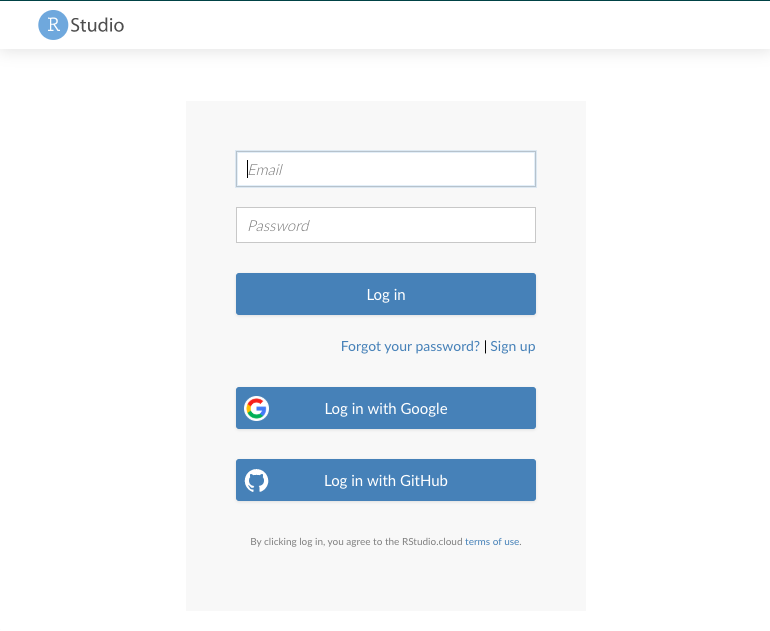
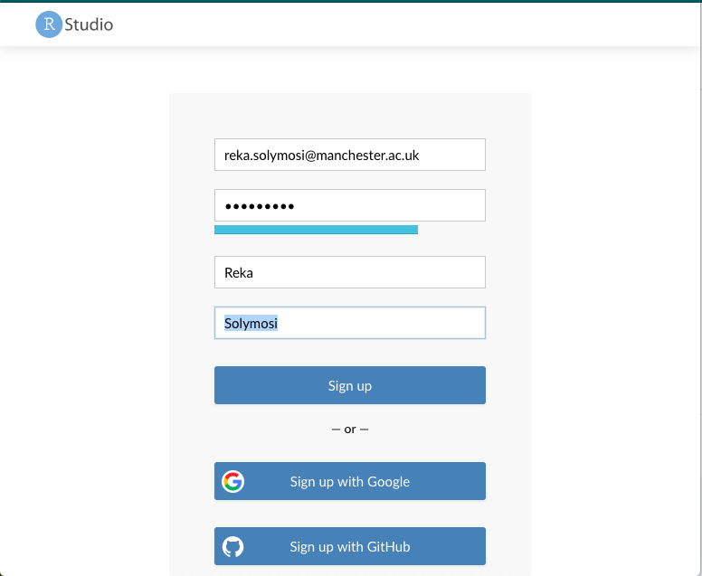
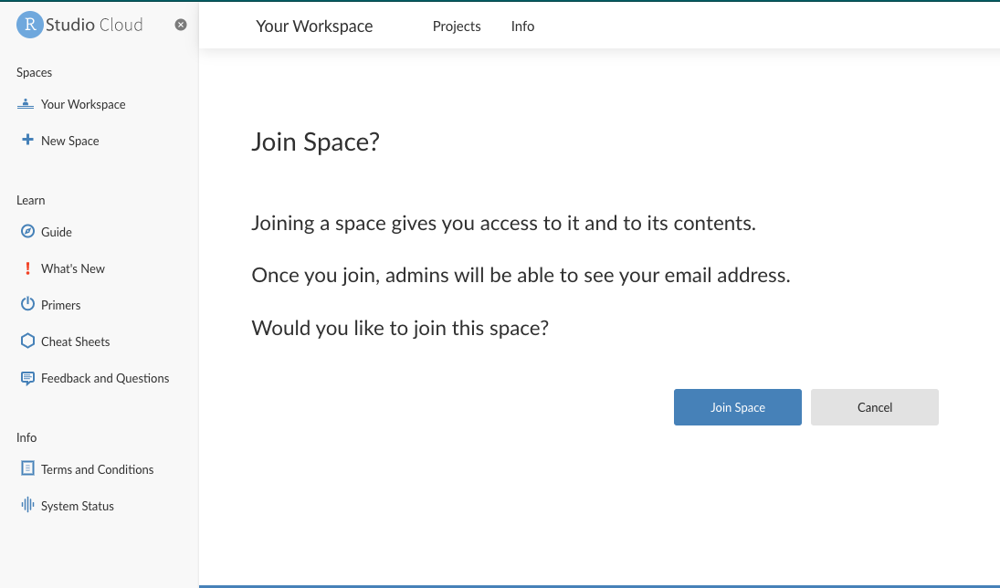
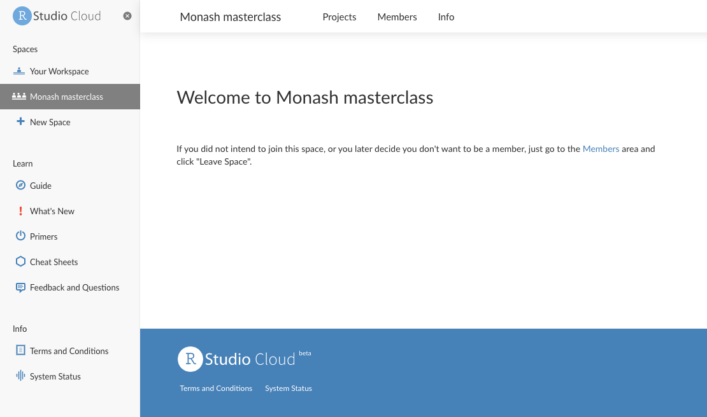
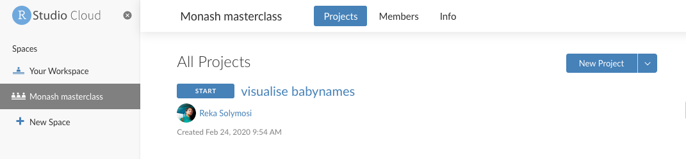
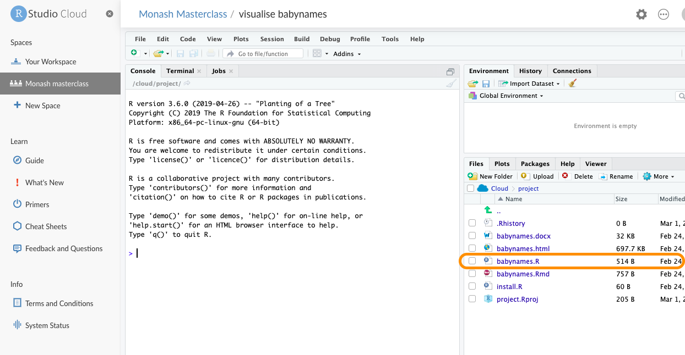
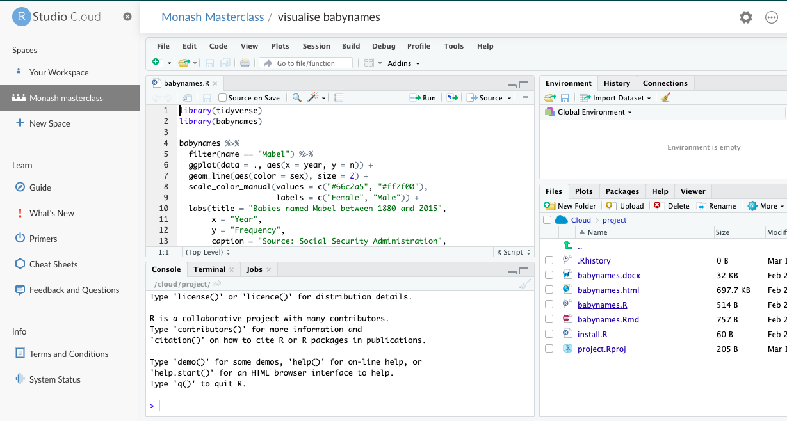

In order to participate on the course, you will need to sign up to R Studio Cloud. First, follow the link to the workspace I have created for this workshop. You can find this on the course website, but I will also include it here: 

[https://rstudio.cloud/spaces/53522/join?access_code=M08YYAUtEQKJSvGDgOaXEABbXDX52zrRkCj%2BQmIB](https://rstudio.cloud/spaces/53522/join?access_code=M08YYAUtEQKJSvGDgOaXEABbXDX52zrRkCj%2BQmIB)

This will take you to the R Studio Cloud page and prompt you to log in (if you already have an account it might just take you straight to the workshop page!). 

If you don't already have an account you will see this: 

- 

You can sign in with  a GitHub account (if you have one) or with your Google account (this is probably a very easy way), or you can just create an account. If you want to just create an account, click on the "Sign up" link. This will take you to the following page: 

- 

Fill in your details like I did mine, and then click sign up. You will then be asked to provide a name for your account. You can use any name, usually firstname-lastname is a good bet! When you have chosen a name click on 'create account'. 

You will get a confirmation email to the email address you have signed up for. 

You will also get taken to a page now, that confirms that you want to join the workspace which we have created for this class. It looks like this: 

- 

Click on "Join Space"

You will then see a tab appear on the left hand side that says "Monash masterclass", and a welcome message: 

Along the top banner you will see three tabs, which say "Projects", "Members", and "Info". Click on the tab which says "Projects". You will now see all the projects that we will be working on in this session. 

To start working on a project click on the "Start" button that is next to it. This should open up the project (may take some time). 

When the project opens, you should be able to see the R Studio console. In the bottom right pane you will see a bunch of file names. (If you do not, then make sure the "File" tab is selected, where you see the tabs "File", "Plots", "Packages", "Help", "Viewer"). 

For example, the first project we are working on today is called "visualise babynames". When you open this, one of the files on the bottom right pane is "babynames.R". Open this by clicking on its name.

Once you click on this, the fourth pane should open up on the top left corner of your screen. This will have some code in there, which is what we will begin with. Your screen should look like this: 

